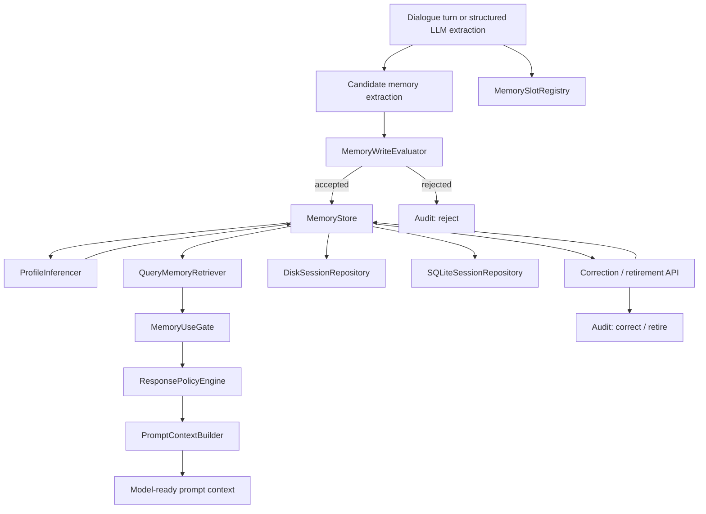
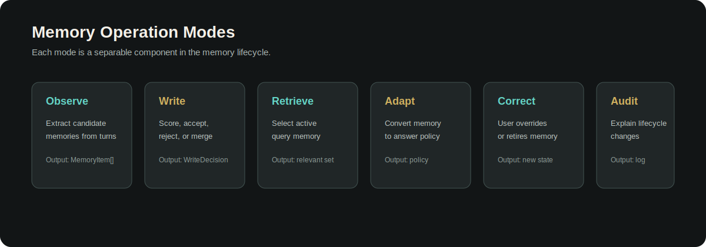

<p align="right">
  <a href="./README.md"></a>
  <a href="./README.zh-CN.md"></a>
</p>

# EvolveMemory

[](./README.md)
[](https://github.com/2sao7sao/EvolveMemory)
[](https://github.com/2sao7sao/EvolveMemory/commits/main)
[](./LICENSE)
[](./requirements.txt)

EvolveMemory is a user-centric memory system prototype for conversational AI.
It turns dialogue into structured memory, decides what is worth keeping, and
uses a memory gate to decide how each active memory may shape the next answer.

The core question:

```text
Given what we know about this user, which memories should be used, suppressed,
or converted into response behavior right now?
```

---

## Quick Links

- [TL;DR](#tldr)
- [Vision](#vision)
- [Why](#why)
- [What It Builds](#what-it-builds)
- [Current Architecture](#current-architecture)
- [Memory Use Gate](#memory-use-gate)
- [Memory Layers](#memory-layers)
- [Event Progress Skills](#event-progress-skills)
- [Neuroscience Design Notes](#neuroscience-design-notes)
- [Component Catalog](#component-catalog)
- [Mode Presets](#mode-presets)
- [Spec Gap](#spec-gap)
- [API](#api)
- [Local Development](#local-development)
- [Roadmap](#roadmap)

---

## TL;DR

- A memory engine for conversational AI, not a generic transcript database.
- Three responsibility layers: fact memory, inferred profile, and event memory.
- Candidate memories are scored before writing through a configurable write policy.
- State memory supports mutual exclusion, coexistence, validity windows, correction, and audit.
- Query-time retrieval is followed by a memory use gate, so memory can be used directly, used only for style, used to trigger follow-up, or suppressed.
- The response policy is generated after gating instead of dumping all memory into a prompt.
- The current implementation is a working FastAPI prototype with local JSON or SQLite persistence.

---

## Vision

The project is designed around one product belief:

> Personal AI should not only remember facts. It should adapt how it communicates.

Memory is useful only when it changes behavior. A good system should know
whether the user wants direct recommendations, calm explanation, dense detail,
minimal follow-up, or a slower step-by-step discussion. Those response choices
should be grounded in remembered facts, evolving events, and revisable profile
signals.

Current status: **Prototype / WIP**.

---

## Why

Most memory systems stop at storage and retrieval:

- They keep facts but do not decide whether a fact is worth keeping.
- They retrieve memory but do not convert it into answer behavior.
- They blur stable facts, short-lived states, preferences, and inferred profile traits.
- They have weak correction paths when the system remembers something wrong.
- They rarely explain why a memory was written, rejected, retired, or merged.

EvolveMemory treats memory as an operational loop:

```text
remember -> validate -> retrieve -> gate -> adapt response -> follow up -> audit
```

---

## What It Builds

The current prototype includes:

- raw Chinese dialogue extraction
- structured LLM extraction payload parsing
- declarative memory slot registry
- write scoring before persistence
- memory store with exclusive/coexisting memory behavior
- active-memory validity windows
- user correction and memory retirement
- audit events for memory lifecycle changes
- profile inference from preferences and states
- query-aware retrieval
- memory use gating for direct use, style-only use, event follow-up, and suppression
- response policy generation
- model-ready prompt context
- FastAPI service endpoints
- local JSON or SQLite persistence
- demo and unit tests

---

## Current Architecture




Runtime flow:

```text
ingest
  -> extract candidates
  -> score write decisions
  -> write accepted memories
  -> reject low-value candidates with audit events
  -> infer profile dimensions
  -> persist session

query
  -> load active memories
  -> retrieve query-relevant memory
  -> gate memory by relevance, freshness, authority, utility, and privacy
  -> build response policy
  -> optionally assemble prompt context
```

---

## Memory Use Gate

The core design principle is that retrieval is not the same as usage. A memory
can be true and still be irrelevant, too sensitive, too stale, or only useful as
communication guidance.

`MemoryUseGate` evaluates candidate memories after retrieval and assigns one
of four actions:

| Action | Meaning | Example |
| --- | --- | --- |
| `use_directly` | The answer may use the memory as content. | Use current `work_status=job_seeking` when the query asks for career advice. |
| `style_only` | The answer may adapt tone, structure, pace, or detail, but should not mention the memory. | Use `communication_style=direct` to answer more directly. |
| `follow_up` | The memory is an evolving event and should trigger one lightweight progress check or next-step suggestion. | "你之前在准备面试，如果还在推进，我建议先更新岗位和时间线。" |
| `suppress` | The memory should not influence this answer. | Do not use age, gender, relationship, or emotional state when unrelated. |

Gate factors:

- `relevance`: whether the memory matches the current query intent.
- `freshness`: whether the memory is still within a useful time window.
- `authority`: whether the memory was user-confirmed or only inferred.
- `utility`: whether using it improves helpfulness or answer quality.
- `privacy`: whether sensitive memory needs stronger relevance before use.

This gives the system a practical answer to the most important product
question: not just "what do we know?", but "what is allowed and useful to use
right now?"

---

## Memory Layers

EvolveMemory separates memory by responsibility rather than only by storage
type.

### Fact Memory

Fact memory stores user-provided or directly observed facts. It includes stable
facts, semi-static states, fluid states, and explicit preferences.

Examples:

- age, education, relationship status, work status
- long-term and short-term interests
- current emotional state or cognitive bandwidth
- direct preferences such as "先给结论" or "别太啰嗦"

Responsibilities:

- maintain exclusivity rules for state slots
- preserve validity windows for fluid states
- expose facts only when the gate allows direct use
- let explicit correction override inferred or stale memory

### Inferred Profile

Inferred profile memory is the system's hypothesis about the user, not a hard
fact. It should mainly control answer behavior and should be easy to revise.

Current dimensions:

- `structure_preference_level`
- `directness_preference_level`
- `detail_tolerance`
- `emotional_support_need`
- `pace_preference`

Responsibilities:

- aggregate repeated facts and preferences into communication policy
- avoid over-personalizing from one weak signal
- remain lower authority than explicit user facts
- normally pass the gate as `style_only`, not `use_directly`

### Event Memory

Events describe things that happened and may shape future context.

Examples:

- changed jobs
- broke up
- moved cities
- started preparing for an exam
- recently began learning skiing

Events are time-sensitive. They often create or update states, and they are
useful for follow-up support.

Responsibilities:

- segment experience into meaningful event records
- track whether an event is open, progressing, blocked, resolved, or stale
- generate event-based follow-up cues when useful
- update related facts and states when new evidence arrives

### Legacy Type Mapping

Internally, the prototype still uses four schema types:

- `event`: event memory
- `state`: fact memory
- `preference`: fact memory used heavily for response adaptation
- `profile`: inferred profile memory

The responsibility split is the product-level model. The schema types are the
current implementation detail.

---

## Event Progress Skills

Events are not static facts. An event is closer to a changing state machine:
it has a beginning, observable progress, possible blockers, and resolution.
EvolveMemory models this through event-progress skills.

Recommended event skill shape:

```json
{
  "skill": "career_event_tracker",
  "event_key": "prepare_interview",
  "status": "open",
  "stage": "preparing",
  "evidence": "我最近准备面试",
  "expected_next_signal": "面试时间、岗位、结果、卡点",
  "followup_policy": {
    "cue": "career or interview query",
    "action": "ask one progress-aware question or give next step",
    "cooldown_days": 7
  }
}
```

Event state examples:

| Status | Meaning | Gate behavior |
| --- | --- | --- |
| `open` | Event is active but incomplete. | Can trigger `follow_up` when query is related. |
| `progressing` | New evidence shows movement. | Merge progress and update next expected signal. |
| `blocked` | User reports obstacle or uncertainty. | Increase priority for support or planning. |
| `resolved` | Event has ended. | Convert useful residue into facts, then retire active event. |
| `stale` | No update after TTL or repeated non-use. | Suppress unless query explicitly revives it. |

This is where a skills-based design fits well: each domain can own its event
ontology, progress states, follow-up policy, and conversion rules. For example,
a career skill tracks interviews and offers, a learning skill tracks exams and
projects, and a relationship skill tracks sensitive life events with stricter
privacy gates.

---

## Neuroscience Design Notes

The event mechanism is inspired by several memory principles from cognitive
neuroscience. These are design analogies, not claims that the software is a
brain model.

- Event segmentation: humans do not store experience as one continuous log.
  Event Segmentation Theory argues that people maintain event models and update
  them when prediction quality degrades or boundaries appear. This supports
  using event boundaries instead of raw transcript chunks.
- Prediction error: context mismatch and prediction error are associated with
  updating episodic memory. For EvolveMemory, a strong mismatch should create a
  new event version or update event status instead of blindly merging facts.
- Reconsolidation/update: retrieved long-term memory can become modifiable when
  relevant new information appears. For EvolveMemory, recalling an event during
  a related query should open a controlled update window.
- Prospective memory: future intentions can be time-based or event-based; event
  cues can trigger retrieval, while reminders reduce cognitive load. For
  EvolveMemory, event follow-up should be cue-triggered and sparse, not constant
  nagging.
- Cognitive control: profile memory should act like top-down control over
  response style, while fact and event memory should require stronger relevance
  to affect content.

Design references:

- [Segmentation in the perception and memory of events](https://pmc.ncbi.nlm.nih.gov/articles/PMC2263140/)
- [Prediction Error Associated With The Perceptual Segmentation of Naturalistic Events](https://pmc.ncbi.nlm.nih.gov/articles/PMC8653780)
- [Context Prediction Analysis and Episodic Memory](https://www.frontiersin.org/journals/behavioral-neuroscience/articles/10.3389/fnbeh.2013.00132/full)
- [Memory Reconsolidation or Updating Consolidation?](https://www.ncbi.nlm.nih.gov/books/NBK3905/)
- [Strategic reminder setting for time-based intentions](https://link.springer.com/article/10.3758/s13421-025-01708-x)

---

## State Details

### States

States describe what is true about the user now.

State dynamics:

- `static`: stable facts, such as education level
- `semi_static`: facts that change occasionally, such as relationship status or work status
- `fluid`: short-lived context, such as being anxious, busy, or preparing for interviews

State relationship rules:

- mutually exclusive: only one active value should exist in an exclusive group
- coexisting: multiple values can be active at the same time
- time-bound: fluid states should naturally expire or be retired

### Preferences

Preferences describe how the user wants to be served.

Examples:

- direct communication
- concise answers
- conclusion first
- step-by-step explanation
- fewer follow-up questions
- stronger recommendations

This is the shortest path from memory to better answers.

### Profile

Profile memory is inferred from dialogue and preference history. It is not a
rigid personality label. It is a set of revisable dimensions with confidence
and evidence.

Current dimensions:

- `structure_preference_level`
- `directness_preference_level`
- `detail_tolerance`
- `emotional_support_need`
- `pace_preference`

---

## Component Catalog

| Component | File | Responsibility |
| --- | --- | --- |
| `MemoryItem` | `memory_system/schema.py` | Normalized memory record with confidence, validity, coexistence, source, and audit metadata. |
| `WriteDecision` | `memory_system/schema.py` | Records write score, threshold, factors, and final write decision. |
| `MemoryAuditEvent` | `memory_system/schema.py` | Explains writes, merges, rejections, retirements, and corrections. |
| `ResponsePolicy` | `memory_system/schema.py` | Compact answer-control object used by the model-facing layer. |
| `SlotDefinition` | `memory_system/registry.py` | Declarative definition for one memory slot: type, dynamics, exclusivity, TTL, scoring weights, and sensitivity. |
| `MemorySlotRegistry` | `memory_system/registry.py` | Central registry of supported memory slots and their default rules. |
| `DialogueMemoryExtractor` | `memory_system/engine.py` | Rule-based Chinese dialogue extractor for the current prototype. |
| `MemoryWriteEvaluator` | `memory_system/engine.py` | Scores candidate memories before persistence. |
| `MemoryStore` | `memory_system/engine.py` | Applies active-memory, merge, retirement, correction, and audit rules. |
| `ProfileInferencer` | `memory_system/engine.py` | Infers user profile dimensions from active states and preferences. |
| `QueryMemoryRetriever` | `memory_system/engine.py` | Retrieves memories relevant to the current user query. |
| `MemoryUseGate` | `memory_system/gating.py` | Decides whether retrieved memory is used directly, style-only, follow-up, or suppressed. |
| `ResponsePolicyEngine` | `memory_system/engine.py` | Converts memory signals into response policy. |
| `StructuredMemoryParser` | `memory_system/structured.py` | Parses LLM-produced JSON extraction payloads into `MemoryItem` objects. |
| `PromptContextBuilder` | `memory_system/prompting.py` | Builds model-ready prompt context from relevant memory and policy. |
| `SessionRepository` | `memory_system/persistence.py` | Storage interface shared by JSON and SQLite repositories. |
| `DiskSessionRepository` | `memory_system/persistence.py` | Persists session memory and audit events to local JSON files. |
| `SQLiteSessionRepository` | `memory_system/persistence.py` | Persists session memory and audit events to a local SQLite database. |
| `SessionMemoryRuntime` | `memory_system/service.py` | Orchestrates extraction, scoring, storage, inference, retrieval, and prompt context. |
| FastAPI app | `app.py` | Provides HTTP endpoints for integration. |
| Demo CLI | `demo.py` | Runs the memory loop locally with sample turns. |

---

## Data Model

Each memory item uses a normalized schema:

```json
{
  "type": "state",
  "key": "relationship_status",
  "value": "single",
  "confidence": 0.92,
  "source": "turn_4",
  "evidence": "我现在单身",
  "valid_from": "2026-04-16T09:00:00+08:00",
  "valid_to": null,
  "confirmed_by_user": true,
  "exclusive_group": "relationship_status",
  "coexistence_rule": "mutually_exclusive",
  "dynamics": "semi_static",
  "tags": [],
  "last_updated": "2026-04-16T09:00:00+08:00"
}
```

Important fields:

- `type`: `event`, `state`, `preference`, or `profile`
- `key`: normalized semantic slot
- `value`: normalized slot value
- `confidence`: confidence in `[0, 1]`
- `source`: turn, model, or correction source
- `evidence`: text or reason supporting the memory
- `valid_from` and `valid_to`: active time window
- `exclusive_group`: conflict group for mutually exclusive memories
- `coexistence_rule`: how the memory interacts with nearby memories
- `dynamics`: stability class

---

## Write Policy

Not every extracted detail should become long-term memory. Candidate memories
are scored before they are written:

```text
memory_value = stability * reuse * personalization_gain * confidence
```

The current `MemoryWriteEvaluator` returns a `WriteDecision`:

```json
{
  "should_write": true,
  "score": 0.641,
  "threshold": 0.16,
  "reason": "passes write policy",
  "factors": {
    "stability": 0.92,
    "reuse": 0.95,
    "personalization_gain": 0.98,
    "confidence": 0.75
  }
}
```

High-value examples:

- stable user facts
- repeated preferences
- major life events
- active work or emotional context
- guidance preferences that influence future answers

Low-value examples:

- one-off throwaway remarks
- weak guesses
- details with low future reuse
- transient facts that do not affect response quality

---

## State Machine Rules

The store uses active-time windows rather than deleting history. Slot defaults
come from `MemorySlotRegistry`, so common state-machine behavior is now
declared centrally instead of being only embedded in extraction logic.

Mutually exclusive examples:

- `relationship_status`: `single`, `dating`, `married`
- `education_level`: `associate`, `bachelor`, `master`, `phd`
- `detail_preference`: `concise`, `detailed`
- `response_opening`: `answer_first`

Coexisting examples:

- `interest_long_term`
- `interest_short_term`
- `response_opening=answer_first` with `explanation_structure=step_by_step`
- multiple life events over time

When a new memory enters the same exclusive group, the previous active memory is
retired by setting `valid_to`. A memory is active only when `valid_to` is empty
or later than the current timestamp.

---

## Mode Presets



The prototype can be reasoned about through operational modes:

```text
observe  -> extract candidates without assuming all are worth keeping
write    -> score, accept, reject, merge, or retire memories
retrieve -> select only query-relevant memories
gate     -> decide direct use, style-only use, event follow-up, or suppression
adapt    -> convert relevant memory into response policy
correct  -> let users override or retire memory
audit    -> inspect why memory changed
```

Mode comparison:

| Mode | Purpose | Typical output |
| --- | --- | --- |
| Observe | Extract candidate memory from dialogue or structured payloads. | Candidate `MemoryItem` list |
| Write | Decide whether memory should persist. | `WriteDecision` and audit events |
| Retrieve | Select memory for the current query. | Relevant active memory subset |
| Gate | Decide how selected memory may influence the answer. | `MemoryGateResult` |
| Adapt | Convert memory signals into answer behavior. | `ResponsePolicy` |
| Correct | Apply explicit user correction or retirement. | Updated active memory and audit events |
| Audit | Explain lifecycle changes. | Write, merge, reject, retire, and correct logs |

---

## Correction And Audit

Users can explicitly correct or retire memory. Corrections are treated as
high-authority writes and create audit events.

Audit actions:

- `write`: new memory persisted
- `merge`: duplicate or equivalent memory merged
- `reject`: candidate failed write policy
- `retire`: previous memory made inactive
- `correct`: user correction inserted

This makes the memory system explainable. A caller can inspect not only what is
remembered, but why it was remembered and what it replaced.

---

## Structured LLM Extraction

The rule extractor is intentionally small. Production systems should use an LLM
to produce structured candidate memories, then pass them through the same write
policy and store.

Expected shape:

```json
{
  "memories": [
    {
      "type": "preference",
      "key": "response_opening",
      "value": "answer_first",
      "confidence": 0.9,
      "evidence": "先给结论",
      "exclusive_group": "response_opening",
      "coexistence_rule": "mutually_exclusive",
      "dynamics": "not_applicable",
      "tags": []
    }
  ]
}
```

`StructuredMemoryParser` converts this payload into `MemoryItem` objects. The
same write policy, audit, persistence, retrieval, and use-gating layers then
apply.

---

## Spec Gap

The initial spec calls for a new memory system from the user's perspective:
what to remember, how to remember it, and how to use it to make answers more
personally adaptive. The current implementation covers the skeleton but still
has important gaps.

| Spec area | Current state | Gap to close |
| --- | --- | --- |
| Events | Basic event memory and gate-triggered follow-up exist. | Need richer event skills, causal links, cooldowns, and event-to-state transitions. |
| Static / dynamic states | `static`, `semi_static`, `fluid`, and registry defaults exist. | Need richer TTL policies, transition rules, and state history summarization. |
| Mutual exclusion | Implemented through `exclusive_group` and `MemorySlotRegistry`. | Need configurable project/user-level registry loading instead of only built-in defaults. |
| Interests | Long-term and short-term interest slots exist. | Need recency scoring, frequency tracking, and interest decay. |
| Profile | Basic inferred profile dimensions exist. | Need psychology-backed trait model, confidence aggregation, evidence accumulation, and user-visible explanations. |
| Memory usage | `MemoryUseGate` decides direct use, style-only use, follow-up, or suppression. | Need learned thresholds, per-user privacy settings, and offline evaluation. |
| Response adaptation | `ResponsePolicy` controls tone, detail, structure, decision mode, pace, empathy, and follow-up after gating. | Need policy-to-answer generation, evaluation, and per-domain policy tuning. |
| LLM extraction | Structured parser exists. | Need live LLM extractor, JSON schema validation, retries, and contradiction checks. |
| Retrieval | Keyword/rule retrieval plus use gating exists. | Need semantic retrieval, query intent classification, and policy-aware ranking before gating. |
| Correction | Explicit correction and retirement exist. | Need UX for reviewing memory and accepting/rejecting suggestions. |
| Audit | Memory lifecycle audit exists. | Need diff UI, export, and privacy review. |
| Persistence | Local JSON and SQLite session repositories exist. | Need migrations, encryption, backups, and multi-user auth. |

---

## API

Start the service:

```bash
uvicorn app:app --reload
```

Storage backend defaults to local JSON files. Use SQLite when you want a single
local database file:

```bash
AME_STORAGE_BACKEND=sqlite uvicorn app:app --reload
```

Optional storage path overrides:

```bash
AME_DATA_DIR=/var/lib/adaptive-memory
AME_JSON_SESSION_DIR=/var/lib/adaptive-memory/sessions
AME_SQLITE_DB_PATH=/var/lib/adaptive-memory/adaptive_memory.sqlite3
```

Health check:

```bash
curl http://127.0.0.1:8000/health
```

Inspect supported memory slots:

```bash
curl http://127.0.0.1:8000/memory-slots
```

Ingest a raw dialogue turn:

```bash
curl -X POST http://127.0.0.1:8000/sessions/demo/ingest \
  -H 'Content-Type: application/json' \
  -d '{"text":"我29岁，硕士毕业，现在单身，最近在找工作。"}'
```

Ingest structured LLM extraction output:

```bash
curl -X POST http://127.0.0.1:8000/sessions/demo/ingest-structured \
  -H 'Content-Type: application/json' \
  -d '{"payload":{"memories":[{"type":"preference","key":"response_opening","value":"answer_first","confidence":0.9,"evidence":"先给结论","exclusive_group":"response_opening"}]}}'
```

Retrieve relevant memory and response policy:

```bash
curl -X POST http://127.0.0.1:8000/sessions/demo/query \
  -H 'Content-Type: application/json' \
  -d '{"query":"给我一点求职建议，回答直接一点。"}'
```

Build model-ready prompt context:

```bash
curl -X POST http://127.0.0.1:8000/sessions/demo/prompt-context \
  -H 'Content-Type: application/json' \
  -d '{"query":"给我一点求职建议，回答直接一点。"}'
```

Inspect active memories:

```bash
curl http://127.0.0.1:8000/sessions/demo/memories
```

Correct a memory:

```bash
curl -X POST http://127.0.0.1:8000/sessions/demo/memories/correct \
  -H 'Content-Type: application/json' \
  -d '{"memory_type":"state","key":"relationship_status","value":"dating","evidence":"我刚才说错了，现在是恋爱中","dynamics":"semi_static"}'
```

Retire a memory:

```bash
curl -X POST http://127.0.0.1:8000/sessions/demo/memories/retire \
  -H 'Content-Type: application/json' \
  -d '{"key":"current_emotional_state","memory_type":"state","reason":"no longer current"}'
```

Read audit events:

```bash
curl http://127.0.0.1:8000/sessions/demo/audit
```

Reset a session:

```bash
curl -X POST http://127.0.0.1:8000/sessions/demo/reset
```

---

## Local Development

Install dependencies:

```bash
python3 -m pip install -r requirements.txt
```

Run the demo:

```bash
python3 demo.py
```

Run with custom turns:

```bash
python3 demo.py \
  --turn "我29岁，硕士毕业，现在单身。" \
  --turn "最近找工作很焦虑，回答直接一点，先给结论。"
```

Run tests:

```bash
python3 -m unittest discover -s tests -p 'test_*.py'
```

Session files are stored under:

```bash
data/sessions/<session_id>.json
```

SQLite mode stores data under:

```bash
data/adaptive_memory.sqlite3
```

Runtime session JSON and SQLite files are ignored by git.

---

## Example Prompt Context

`/prompt-context` returns a model-facing object with:

- `system_prompt`
- `memory_gate`
- `relevant_memory_lines`
- `response_policy`
- `assembled_prompt`

The assembled prompt is intentionally explicit:

```text
[System Guidance]
Use the memory gate as the first control layer.

[Memory Use Gate]
- work_status: action=use_directly, layer=fact_memory
- response_opening: action=style_only, layer=fact_memory

[Relevant User Memory]
- work_status: job_seeking
- response_opening: answer_first

[Response Policy]
- tone=direct_but_warm
- structure=answer_first
- decision_mode=give_recommendation

[Current User Query]
给我一点求职建议
```

---

## Current Limitations

- The built-in raw dialogue extractor is rule-based and Chinese-first.
- Retrieval is keyword and rule weighted, not embedding based.
- Persistence is local JSON or SQLite; production migrations, encryption, backups, and auth are still missing.
- Profile inference is deterministic and narrow.
- Event progress skills are documented, but only the first gate-triggered follow-up behavior is implemented.
- There is no production LLM call in this repository yet.
- There is no authentication layer around the FastAPI service.
- There is no UI for memory review, correction, or audit inspection.

These are deliberate prototype boundaries. The architecture keeps extraction,
write policy, storage, retrieval, and prompt assembly separate so each layer can
be upgraded independently.

---

## Roadmap

1. Add domain event skills for career, learning, relationship, and project progress.
2. Add cooldown-aware event follow-up and event-to-state conversion rules.
3. Connect `StructuredMemoryParser` to a production LLM extraction call.
4. Add semantic retrieval with embeddings before `MemoryUseGate`.
5. Add configurable decay policies by memory type and dynamics.
6. Add learned gate thresholds and offline personalization evaluation.
7. Add contradiction detection beyond exclusive groups.
8. Add a memory review UI for accepting, correcting, and retiring memories.
9. Add production-grade migrations, encrypted persistence, and privacy controls.
10. Add policy-conditioned answer generation over `assembled_prompt`.

---

## Star History


---

## Commit Activity


---

## Repository Status

This project is an early prototype. It is useful for design exploration,
integration experiments, and validating the architecture of a personalized
memory system. It is not yet a production-grade memory service.

## License

MIT License. See [LICENSE](LICENSE).
