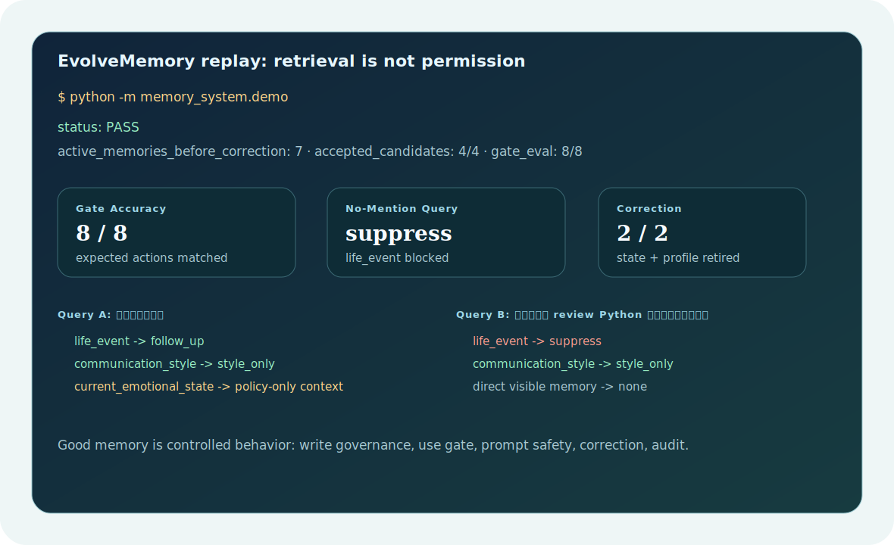
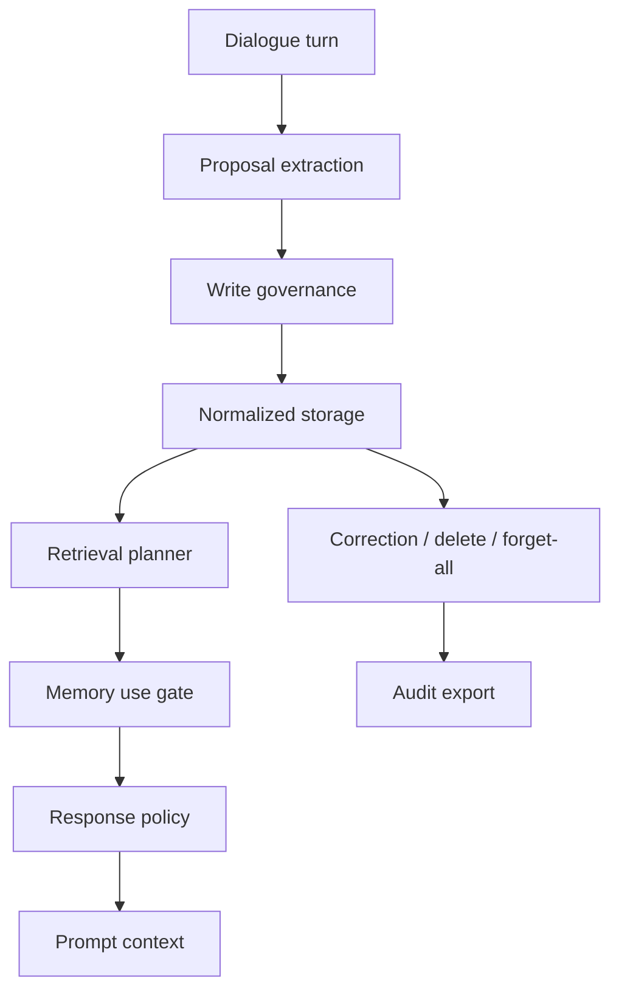

<p align="center">
  <a href="./README.zh-CN.md">简体中文</a>
  ·
  <a href="https://2sao7sao.github.io/EvolveMemory/">Product Page</a>
  ·
  <a href="./examples/adaptive_memory_replay.md">Replay</a>
  ·
  <a href="./CONTRIBUTING.md">Contributing</a>
</p>

<p align="center">
  
  
  
  
</p>

# Memory That Knows When To Stay Quiet

**EvolveMemory is an adaptive memory runtime for conversational AI and agents.**

Most memory systems remember too much and use memory too bluntly. That creates
long prompts, stale assumptions, privacy risk, and the awkward feeling that the
assistant is dragging old information into the wrong conversation.

EvolveMemory treats memory as a control system:

> Remember what matters. Retrieve what is relevant. Use only what is appropriate.



## The 30-Second Pitch

```text
User turn -> Memory proposal -> Write policy -> Store -> Retrieve -> Use gate -> Response policy
```

The main distinction is simple:

| Common memory layer | EvolveMemory |
| --- | --- |
| Stores facts | Scores whether a fact should be stored |
| Retrieves memories | Decides whether retrieved memories may be used |
| Injects context | Converts memory into direct use, style-only, follow-up, summarize-only, hidden constraint, or suppress |
| Makes prompts longer | Makes behavior more adaptive and controlled |
| Has weak correction paths | Supports correction, deletion, review queue, forget-all, and audit export |

## Run The Replay

```bash
git clone https://github.com/2sao7sao/EvolveMemory.git
cd EvolveMemory
python -m pip install -r requirements.txt
python examples/replay_adaptive_memory.py
```

The replay demonstrates the core product behavior:

| Query | Memory behavior |
| --- | --- |
| "面试怎么准备？" | Interview event is allowed as follow-up; style preferences shape the answer. |
| "今天只帮我 review Python 代码，不用提面试。" | The interview event is suppressed; direct-answer style remains available. |

That is the point: memory can adapt the assistant without making it creepy.

## Why It Exists

Good AI memory is not a database problem alone. It is a product behavior
problem.

| Failure mode | Why it matters | EvolveMemory response |
| --- | --- | --- |
| Saves conversational residue | Memory becomes noisy and expensive | Write governance and duplicate/conflict checks |
| Mentions irrelevant personal facts | User experience becomes creepy | Memory use gate and safe-to-mention policy |
| Confuses preference, event, profile, and state | Prompt context becomes messy | Layered memory model |
| Cannot correct stale assumptions | Trust breaks after user correction | Correction, delete, forget-all, audit |
| Always injects retrieved memories | Long prompts do not equal better behavior | Response policy compiles only what is useful |

## What It Provides

| Layer | Role |
| --- | --- |
| Proposal extraction | Converts turns or structured model payloads into memory candidates. |
| Write governance | Accepts, rejects, merges, supersedes, or routes memories to review. |
| Normalized storage | Stores records, evidence, audit events, review queue, settings, and event states. |
| Retrieval planning | Scores candidates before policy enforcement. |
| Memory use gate | Decides direct use, style-only, follow-up, summarize-only, hidden constraint, clarify, or suppress. |
| Response policy | Converts gated memory into tone, structure, detail, empathy, and decision mode. |
| Review and audit | Supports correction, deletion, forget-all, review queue, and export. |

## Proof Signals

Last verified locally:

| Signal | Result | Command |
| --- | ---: | --- |
| Runtime + API tests | `52 / 52 passed` | `python -m pytest -q` |
| Gate eval | `8 / 8 correct` | `python -m evals.runner --suite gate_eval` |
| Replay demo | `PASS` | `python examples/replay_adaptive_memory.py` |

The current eval suite is a regression seed, not a broad benchmark. It checks
the product-defining distinction: retrieved memory is not automatically allowed
memory.

## Quick Commands

```bash
# Run the default extraction demo
python demo.py

# Run memory gate eval
python -m evals.runner --suite gate_eval

# Start the API
uvicorn app:app --reload

# Use SQLite persistence
AME_STORAGE_BACKEND=sqlite uvicorn app:app --reload
```

## API Shape

| Endpoint | Purpose |
| --- | --- |
| `POST /v2/users/{user_id}/turns/ingest` | Ingest a turn into the normalized runtime. |
| `POST /v2/users/{user_id}/memory/query` | Retrieve and gate memories for a query. |
| `POST /v2/users/{user_id}/prompt-context` | Compile model-ready memory context. |
| `GET /v2/users/{user_id}/memory/review-queue` | Inspect memories requiring confirmation. |
| `POST /v2/users/{user_id}/memory/{memory_id}/correct` | Correct and retire conflicting records. |
| `POST /v2/users/{user_id}/memory/forget-all` | Clear memory with audit trail. |
| `GET /v2/users/{user_id}/memory/audit/export` | Export records, settings, events, and audit data. |

## When To Use It

Good fit:

| Product | Why |
| --- | --- |
| Personal assistants | Need tone, style, and event continuity. |
| AI companions | Need subtle adaptation without forced recall. |
| Workflow agents | Need memory use policy, review, and audit. |
| Long-running sessions | Need correction and stale-memory suppression. |

Poor fit:

| Product | Better choice |
| --- | --- |
| Stateless bots | Do not add memory if output should never adapt. |
| Simple transcript search | Use search or RAG. |
| Opaque memory stores | EvolveMemory is designed for inspectable, user-governed memory. |

## Architecture



## Repository Map

```text
memory_system/   # extraction, writing, persistence, retrieval, gates, events, profiles
evals/           # gate evaluation runner, metrics, JSONL cases
tests/           # runtime, persistence, API, correction, governance tests
examples/        # replay demos
docs/            # product page and design notes
app.py           # FastAPI service
demo.py          # local command-line demo
```

## Roadmap

| Area | Next step |
| --- | --- |
| Evaluation | Add noisy multi-turn, stale memory, correction, and privacy benchmarks. |
| Extraction | Add provider-backed extraction with schema validation and disagreement checks. |
| Privacy | Strengthen sensitive-memory policy and adversarial prompt tests. |
| Integration | Provide chatbot, workflow, and multi-agent harness examples. |

## Security

Do not commit real user transcripts, local SQLite stores, session JSON, API keys,
or debug exports containing personal data. See [SECURITY.md](SECURITY.md).

## License

MIT. See [LICENSE](LICENSE).
