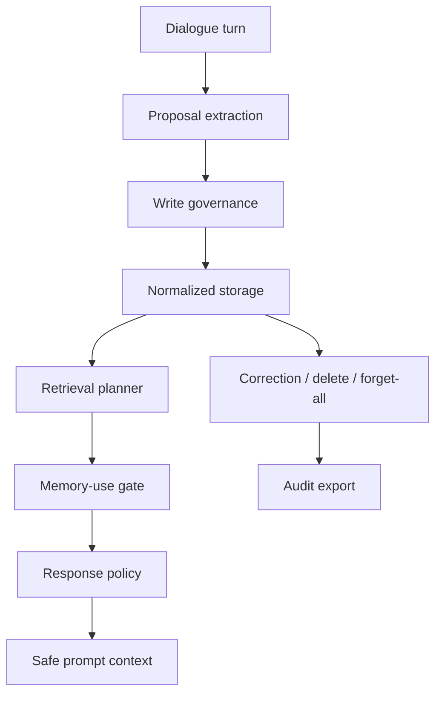

<p align="center">
  <a href="./README.zh-CN.md">简体中文</a>
  ·
  <a href="https://2sao7sao.github.io/EvolveMemory/">Product Page</a>
  ·
  <a href="./examples/adaptive_memory_replay.md">Adaptive Replay</a>
  ·
  <a href="./CONTRIBUTING.md">Contributing</a>
</p>

<p align="center">
  
  
  
  
</p>

# EvolveMemory

**Adaptive memory runtime: decide what to remember, what to use, what to hide, and what to forget.**

Memory should make an AI feel more useful and natural. It should not make the
assistant sound like it is dragging old private details into every answer.

EvolveMemory treats memory as a product control layer:

> Remember selectively. Retrieve candidates. Gate permission. Compile safe prompt context. Correct or forget on demand.


## 30-Second Product Path

```text
User turn
  -> memory proposal
  -> write governance
  -> normalized store
  -> retrieval planning
  -> memory-use gate
  -> response policy
  -> safe prompt context
  -> correction / audit
```

| Common memory system | EvolveMemory |
| --- | --- |
| Saves every extracted fact | Scores whether a candidate should be written |
| Retrieves and injects memories | Separates retrieval from permission |
| Mentions personal details too eagerly | Uses direct, style-only, follow-up, summarize-only, hidden, clarify, or suppress actions |
| Makes prompts longer | Compiles only prompt-safe context |
| Forgets poorly | Supports correction, retirement, forget-all, review queue, and audit export |

## 5-Minute Replay

```bash
git clone https://github.com/2sao7sao/EvolveMemory.git
cd EvolveMemory
python -m pip install -r requirements.txt
python -m memory_system.demo
```

Expected shape:

```text
# EvolveMemory Adaptive Replay

status: PASS
active_memories_before_correction: 7
accepted_candidates: 4/4
gate_eval: 8/8

## Product metrics
- gate_action_accuracy: 1.00 (8/8)
- explicit_suppression_rate: 1.00 (1/1)
- style_continuity_rate: 1.00 (4/4)
- prompt_safety_rate: 1.00 (1/1)
- correction_retirement_rate: 1.00 (2/2)
```

`python examples/replay_adaptive_memory.py` runs the same product path.

## What The Replay Proves

The replay stores two turns:

| Turn | Meaning |
| --- | --- |
| `我最近准备面试，有点焦虑。` | Ongoing event + sensitive emotional state |
| `回答直接一点，先给结论。` | Durable communication preference |

Then it asks two different queries:

| Query | Correct memory behavior |
| --- | --- |
| `面试怎么准备？` | Use interview event as `follow_up`; apply style preferences without exposing raw profile facts. |
| `今天只帮我 review Python 代码，不用提面试。` | Suppress the interview event; keep style adaptation; avoid direct visible memory injection. |

Finally it simulates a correction: the user does not want anxiety remembered.
The product path retires both the sensitive state and its derived profile signal.

## Metrics That Map To Code

| Metric | What it measures | Runtime source |
| --- | --- | --- |
| `gate_action_accuracy` | Expected memory-use actions across regression cases | `evals.runner.run_gate_eval` |
| `explicit_suppression_rate` | Whether explicit "do not mention X" suppresses the matching event | `MemoryUseGate` |
| `style_continuity_rate` | Whether style preferences remain useful across relevant and unrelated queries | `SessionMemoryRuntime.query` |
| `prompt_safety_rate` | Whether no direct visible memory is injected for the no-mention query | `PromptContextBuilder` |
| `correction_retirement_rate` | Whether correction retires sensitive state and derived profile memory | `SessionMemoryRuntime.retire_memory` |

Run the product eval:

```bash
python -m evals.runner --suite product_replay_eval
```

Run the gate-only regression:

```bash
python -m evals.runner --suite gate_eval
```

## Developer Surface

```bash
# Run the product replay
python -m memory_system.demo

# Run the original extraction demo
python demo.py

# Start the API
uvicorn app:app --reload

# Use SQLite persistence
AME_STORAGE_BACKEND=sqlite uvicorn app:app --reload
```

Minimal runtime integration:

```python
from datetime import datetime
from zoneinfo import ZoneInfo

from memory_system import SessionMemoryRuntime

runtime = SessionMemoryRuntime(session_id="user-1")
now = datetime(2026, 5, 1, 9, 0, tzinfo=ZoneInfo("Asia/Shanghai"))

runtime.ingest_turn("回答直接一点，先给结论。", "turn_1", now)
context = runtime.prompt_context("帮我 review 这段代码。", now)
print(context["assembled_prompt"])
```

## API Shape

| Endpoint | Purpose |
| --- | --- |
| `POST /v2/users/{user_id}/turns/ingest` | Ingest a user turn into the normalized runtime. |
| `POST /v2/users/{user_id}/memory/query` | Retrieve and gate memories for the current query. |
| `POST /v2/users/{user_id}/prompt-context` | Compile model-ready memory context. |
| `GET /v2/users/{user_id}/memory/review-queue` | Inspect memories requiring confirmation. |
| `POST /v2/users/{user_id}/memory/{memory_id}/correct` | Correct and retire conflicting records. |
| `POST /v2/users/{user_id}/memory/forget-all` | Clear memory with audit trail. |
| `GET /v2/users/{user_id}/memory/audit/export` | Export records, settings, events, and audit data. |

## Architecture



## Stable vs Prototype

| Layer | Current status |
| --- | --- |
| Rule extraction, write policy, use gate, prompt context | Supported local product path |
| FastAPI endpoints and in-memory / SQLite persistence | Supported for prototypes |
| Review queue, correction, delete, forget-all, audit export | Implemented for governance demos |
| LLM extraction | Schema and validator exist; provider-backed extraction is still prototype |
| Benchmarks | Regression seeds only, not broad personal-memory benchmark claims |

## Fit / Non-Fit

Good fit:

| Product | Why |
| --- | --- |
| Personal assistants | Need durable style, events, and correction paths |
| AI companions | Need adaptation without creepy recall |
| Workflow agents | Need memory governance, audit, and prompt-safe context |
| Long-running sessions | Need stale-memory suppression and forget controls |

Poor fit:

| Product | Better choice |
| --- | --- |
| Stateless bots | Do not add memory when output should never adapt |
| Transcript search | Use search or RAG |
| Uninspectable black-box memory | Use a governed store first |
| Highly regulated production memory | Add policy review, privacy review, and red-team tests before launch |

## Repository Map

```text
memory_system/   runtime, demo report, extraction, gates, retrieval, context, storage
evals/           gate and product replay evaluation runners
tests/           runtime, API, persistence, correction, prompt-safety tests
examples/        runnable replay and product walkthrough
docs/            GitHub Pages product page and design notes
app.py           FastAPI service
demo.py          local extraction demo
```

## Roadmap

| Area | Next step |
| --- | --- |
| Evaluation | Add noisy multi-turn, stale memory, correction, and privacy stress suites |
| Extraction | Add provider-backed extraction with schema validation and disagreement checks |
| Privacy | Add sensitive-memory red-team prompts and retention policy fixtures |
| Integration | Add chatbot, workflow, and multi-agent harness examples |

## Security

Do not commit real user transcripts, local SQLite stores, session JSON, API keys,
or debug exports containing personal data. See [SECURITY.md](SECURITY.md).

## License

MIT. See [LICENSE](LICENSE).
