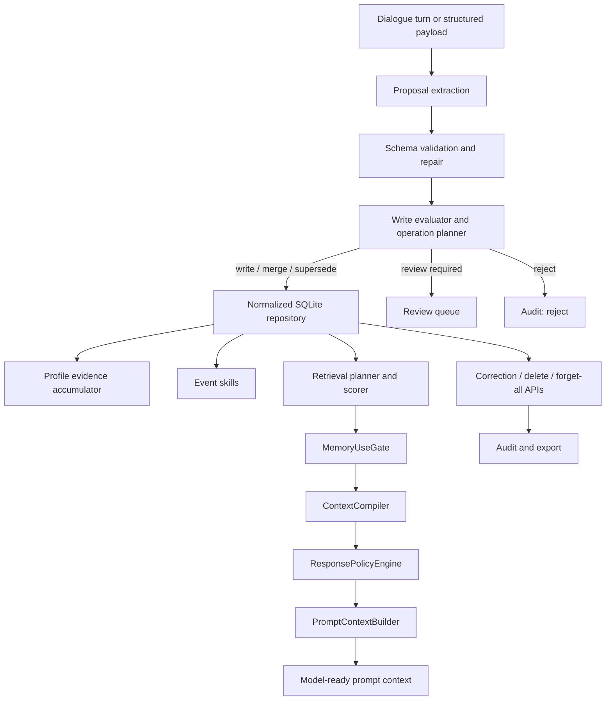

<p align="center">
  <a href="./README.md"></a>
  <a href="./README.zh-CN.md"></a>
  <a href="./CONTRIBUTING.md"></a>
  <a href="./LICENSE"></a>
  
  
</p>

# EvolveMemory

**EvolveMemory is an adaptive memory runtime for conversational AI and agents.**

It decides what should be remembered, what should be ignored, which memories
are relevant to the current task, and how those memories should change the next
response. The project is designed for agent products where memory must be
structured, explainable, correctable, reviewable, and safe to use.

```text
User turn -> Proposals -> Write policy -> Store -> Retrieve -> Use gate -> Response policy
```

## Why EvolveMemory

Most memory systems over-focus on storage:

- They save too much conversational residue.
- They retrieve facts without deciding whether those facts should affect the answer.
- They mix stable profile, short-lived state, preferences, and events into one bucket.
- They lack explicit correction, retirement, review, and audit paths.
- They make prompts longer without making behavior more reliable.

EvolveMemory treats memory as a control system. A memory is valuable only if it
can change behavior at the right moment and stay silent when it is irrelevant,
sensitive, stale, or low-confidence.

## Product Principle

The goal is not to make the assistant mention everything it knows. The goal is
for memory to improve the next interaction without feeling forced.

```text
Remember what matters -> gate what may be used -> adapt the response -> stay silent when irrelevant
```

## Core Design

| Layer | What it does | Product value |
| --- | --- | --- |
| Proposal extraction | Converts dialogue or structured model payloads into validated memory proposals. | Keeps raw model output away from direct memory writes. |
| Write governance | Scores candidates, detects duplicates and contradictions, and plans memory operations. | Reduces noisy, conflicting, and low-confidence writes. |
| Normalized storage | Stores records, evidence, audit events, review queue, settings, and event states in SQLite. | Makes memory inspectable, portable, and governable. |
| Retrieval planning | Classifies query intent and scores candidate memories before gate decisions. | Keeps prompt context focused before policy enforcement. |
| Memory use gate | Classifies memory as direct use, style-only, follow-up, summarize-only, clarify, hidden constraint, or suppress. | Separates "retrieved" from "safe and useful to use". |
| Response policy | Converts gated memory into answer style, structure, detail, empathy, pace, and decision mode. | Makes memory change behavior without dumping everything into the prompt. |
| Event skills | Tracks career, learning, relationship, relocation, and onboarding progress. | Turns evolving user events into controlled follow-up behavior. |
| Review and audit | Supports correction, deletion, forget-all, review queue approval, and export. | Makes memory recoverable, user-governed, and inspectable. |

## Architecture




## Capability Snapshot

Last verified locally on **2026-05-07**.

| Signal | Current result | Command |
| --- | ---: | --- |
| Runtime and API tests | `52 / 52 passed` | `python -m unittest discover -s tests -p "test_*.py"` |
| Pytest compatibility | `52 / 52 passed` | `python -m pytest -q` |
| Gate action eval | `8 / 8 correct` | `python -m evals.runner --suite gate_eval` |
| Gate action accuracy | `1.0000` | `python -m evals.runner --suite gate_eval` |

The current eval suite contains three seed scenarios: interview-preparation
memory should trigger follow-up and style policy, irrelevant sensitive facts
should be suppressed for an unrelated coding task, and explicit "do not mention"
requests should suppress the related event while preserving style preferences.
This is a regression seed, not a large-scale benchmark. It is useful because it
tests the core product distinction: memory retrieval is not the same as memory
permission.

The test suite covers legacy runtime compatibility, normalized SQLite storage,
write-governance operations, review queue flows, sensitivity handling, event
skills, profile evidence accumulation, retrieval planning, memory-use gating,
prompt-context assembly, correction/deletion/forget-all APIs, audit export,
and v2 ingest/query contracts.

## Quick Start

```bash
git clone https://github.com/2sao7sao/EvolveMemory.git
cd EvolveMemory
python -m pip install -r requirements.txt
```

Run the demo:

```bash
python demo.py
```

Run tests and evals:

```bash
python -m unittest discover -s tests -p "test_*.py"
python -m evals.runner --suite gate_eval
```

Read the adaptive replay:

- [Adaptive memory replay](examples/adaptive_memory_replay.md)

Run the replay:

```bash
python examples/replay_adaptive_memory.py
```

Start the API:

```bash
uvicorn app:app --reload
```

Use SQLite persistence:

```bash
AME_STORAGE_BACKEND=sqlite uvicorn app:app --reload
```

## API Surface

| Endpoint | Purpose |
| --- | --- |
| `GET /health` | Check service health and storage backend. |
| `GET /memory-slots` | Inspect declarative memory slot rules. |
| `POST /sessions/{session_id}/ingest` | Ingest one user turn through the legacy-compatible runtime. |
| `POST /sessions/{session_id}/query` | Retrieve, gate, and compile memory for a query. |
| `POST /sessions/{session_id}/prompt-context` | Build model-ready prompt context. |
| `POST /sessions/{session_id}/memories/correct` | Correct a memory and retire conflicting active state. |
| `GET /sessions/{session_id}/audit` | Inspect legacy lifecycle events. |
| `POST /v2/users/{user_id}/turns/ingest` | Ingest a turn into the Phase 2 normalized runtime. |
| `POST /v2/users/{user_id}/memory/query` | Query normalized records with retrieval planning and use gating. |
| `POST /v2/users/{user_id}/prompt-context` | Compile Phase 2 memory context for model prompting. |
| `GET /v2/users/{user_id}/memory/review-queue` | Inspect memories that require user confirmation. |
| `POST /v2/users/{user_id}/memory/review-queue/{review_id}/resolve` | Approve or reject review-queue items. |
| `PUT /v2/users/{user_id}/memory/settings` | Update user memory settings. |
| `POST /v2/users/{user_id}/memory/{memory_id}/correct` | Correct a normalized memory record. |
| `POST /v2/users/{user_id}/memory/{memory_id}/delete` | Tombstone-delete one normalized memory. |
| `POST /v2/users/{user_id}/memory/forget-all` | Clear user memory with audit trail. |
| `GET /v2/users/{user_id}/memory/audit/export` | Export records, settings, review items, events, and audit data. |
| `GET /v2/users/{user_id}/memory/profile-evidence` | Inspect evidence behind inferred profile hypotheses. |
| `GET /v2/users/{user_id}/memory/events` | Inspect active event-state memories. |

## Example

```bash
curl -X POST http://127.0.0.1:8000/v2/users/demo/turns/ingest \
  -H "Content-Type: application/json" \
  -d '{"session_id":"main","text":"我最近准备面试，有点焦虑。回答直接一点，先给结论。"}'

curl -X POST http://127.0.0.1:8000/v2/users/demo/prompt-context \
  -H "Content-Type: application/json" \
  -d '{"session_id":"main","query":"面试怎么准备？","options":{"include_debug":true}}'
```

The resulting context separates direct user facts, style policy, event
follow-up cues, hidden constraints, clarification prompts, and the current user
query. That separation is the main reason the model can use memory without
blindly exposing every stored fact.

## Repository Layout

```text
memory_system/   # extraction, writing, persistence, retrieval, gates, events, profiles, service runtime
evals/           # gate evaluation runner, metrics, and JSONL cases
tests/           # runtime, persistence, API, correction, governance, and v2 contract tests
app.py           # FastAPI service
demo.py          # local command-line demo
data/            # local JSON or SQLite persistence output
docs/            # design review, roadmap, and optimization notes
```

## When To Use It

| Good fit | Poor fit |
| --- | --- |
| Personal assistants that must adapt tone, structure, and follow-up behavior. | Stateless bots where memory should never affect output. |
| Agent products that need explicit memory write and use policies. | Simple transcript search. |
| Workflows where privacy and relevance matter at query time. | Systems that always inject all retrieved memory into the prompt. |
| Applications that need correction, review, deletion, forget-all, and audit trails. | Fully opaque memory stores with no lifecycle inspection. |

## Current Boundaries

EvolveMemory is still a prototype. It does not yet prove long-horizon memory
quality, large-scale user simulation, extraction quality across many model
providers, privacy robustness under adversarial prompts, or production latency
under load. The current tests validate the engineering loop and core behavior
contracts. A larger benchmark should add noisy multi-turn conversations,
ambiguous user intent, stale memory, sensitive facts, correction conflicts,
multilingual data, model-extracted payloads, and load-oriented API measurements.

## Roadmap

| Area | Next direction |
| --- | --- |
| Evaluation | Expand gate, write-policy, correction, drift, and long-context memory benchmarks. |
| Extraction | Add production model providers with schema validation and disagreement checks. |
| Privacy | Strengthen sensitive-memory policy, adversarial prompt tests, and user controls. |
| Storage | Add migration tooling, retention policy, and multi-user isolation hardening. |
| Agent integration | Provide harness examples for chatbots, workflows, and multi-agent systems. |

## License

MIT. See [LICENSE](LICENSE).
