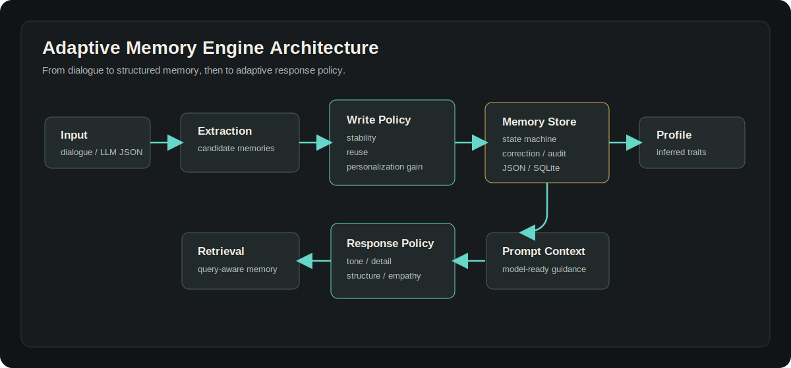
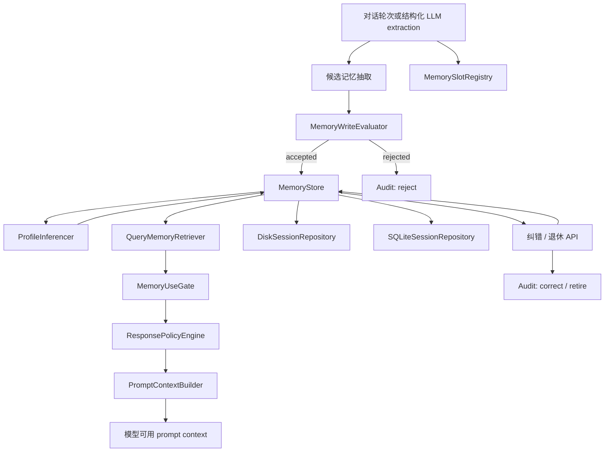

<p align="right">
  <a href="./README.md"></a>
  <a href="./README.zh-CN.md"></a>
</p>

# EvolveMemory

[](./README.zh-CN.md)
[](https://github.com/2sao7sao/EvolveMemory)
[](https://github.com/2sao7sao/EvolveMemory/commits/main)
[](./LICENSE)
[](./requirements.txt)

EvolveMemory 是一个面向对话式 AI 的用户中心记忆系统原型。它不只是保存聊天记录，而是把对话转成结构化记忆，判断哪些值得写入，并通过记忆使用门控决定当前回答应该使用、抑制、追踪还是仅用于调整表达风格。

核心问题：

```text
基于当前对用户的理解，哪些记忆应该被使用，哪些应该被抑制，
哪些应该转化成回答策略或事件跟进？
```

---

## 快速导航

- [一句话](#一句话)
- [设计目标](#设计目标)
- [为什么需要这个项目](#为什么需要这个项目)
- [当前能力](#当前能力)
- [系统架构](#系统架构)
- [Phase 2 Foundation](#phase-2-foundation)
- [记忆使用门控](#记忆使用门控)
- [记忆分层](#记忆分层)
- [事件进展 Skills](#事件进展-skills)
- [脑科学设计依据](#脑科学设计依据)
- [组件目录](#组件目录)
- [API](#api)
- [本地开发](#本地开发)
- [当前差距](#当前差距)
- [路线图](#路线图)

---

## 一句话

- EvolveMemory 是对话式 AI 的个性化记忆引擎，不是普通 transcript database。
- 当前责任层分为事实记忆、推理画像、事件记忆。
- 写入前先评分，避免把低价值、短暂、弱证据内容长期保存。
- 查询时先检索，再进入 `MemoryUseGate`，判断记忆是直接使用、仅用于风格、触发事件跟进，还是抑制。
- 状态记忆支持互斥、共存、有效期、纠错和审计。
- 当前是 FastAPI 原型，支持 JSON / SQLite 本地持久化。

---

## 设计目标

项目基于一个产品判断：

> 个人 AI 不应该只记住事实，它应该知道如何更适合这个用户地沟通。

记忆只有在改变模型行为时才有价值。一个好的记忆系统需要知道用户是否偏好直接建议、慢慢解释、先给结论、少问追问、更多细节、或者更强的情绪支持。这些回答方式不应该靠固定 prompt 猜测，而应该由事实、事件和可修正的人物画像共同决定。

当前状态：**Prototype / WIP**。

---

## 为什么需要这个项目

很多记忆系统停留在存储和检索：

- 记录了事实，但没有判断这个事实是否值得长期保存。
- 检索了记忆，但没有决定这条记忆是否应该用于当前回答。
- 混淆了稳定事实、短期状态、偏好、事件和画像推断。
- 当系统记错时，纠错、退休和审计路径不清晰。
- 很少解释为什么写入、拒绝、合并、退休某条记忆。

EvolveMemory 把记忆视为一个操作闭环：

```text
记住 -> 评估 -> 检索 -> 门控 -> 调整回答 -> 主动跟进 -> 审计
```

---

## 当前能力

当前原型包含：

- 中文对话规则抽取
- 结构化 LLM extraction payload 解析
- 声明式 memory slot registry
- 写入前评分和拒绝机制
- 互斥 / 共存状态管理
- 有效期窗口和 active memory 判断
- 用户纠错和记忆退休
- 记忆生命周期 audit log
- 基于偏好和状态的画像推理
- 查询相关记忆检索
- 记忆使用门控：直接使用、仅用于风格、事件跟进、抑制
- response policy 生成
- model-ready prompt context
- FastAPI 服务接口
- JSON / SQLite 本地持久化
- demo 和单元测试

---

## 系统架构





运行流程：

```text
ingest
  -> 抽取候选记忆
  -> 计算写入分数
  -> 写入高价值记忆
  -> 拒绝低价值记忆并记录 audit
  -> 推理画像维度
  -> 持久化 session

query
  -> 读取 active memories
  -> 检索 query 相关候选记忆
  -> 按相关性、新鲜度、权威性、效用、隐私进行使用门控
  -> 构建 response policy
  -> 生成 prompt context
```

---

## Phase 2 Foundation

Phase 2 优化规格已纳入仓库：
[docs/phase2-optimization-spec.md](docs/phase2-optimization-spec.md)。
当前先落地第一批 foundation 能力，并保持 Phase 1 兼容：

- `memory_system/models.py` 增加 `MemoryRecord`、`MemoryEvidence`、`MemoryOperation`、`EventMemoryState`、graph edge 等 Phase 2 模型。
- 增加 `MemoryItem -> MemoryRecord` adapter，为后续 normalized storage 做准备。
- `MemoryUseGate` 扩展到 Phase 2 的 7 个 action：`use_directly`、`style_only`、`follow_up`、`clarify`、`hidden_constraint`、`summarize_only`、`suppress`。
- `ContextCompiler` 将上下文拆成 direct facts、style policy、event follow-up cues、hidden constraints、clarification prompts。
- `NormalizedSQLiteMemoryRepository` 增加第一版 Phase 2 normalized `memory_records` 表、索引、CRUD、tombstone delete 和旧 `MemoryStore` 迁移路径。
- `WeightedMemoryWriteEvaluatorV2`、`ContradictionDetector`、`MemoryOperationPlanner` 增加第一版确定性写入治理：加权评分、硬规则、重复处理、review routing 和 supersession planning。
- `TurnPreprocessor`、`MemoryCommandDetector`、`SensitivityClassifier`、`RuleMemoryProposalExtractor` 增加第一版 Phase 2 proposal extraction pipeline，同时保留无网络依赖的 LLM extractor 边界。
- `CareerEventSkill` 增加第一版面试 / 求职事件状态 skill，用于进展识别和 follow-up 判断。
- 新增 `/v2/users/{user_id}/turns/ingest`、`/v2/users/{user_id}/memory/query`、`/v2/users/{user_id}/prompt-context`，提供 Phase 2 API 形态。
- `evals/runner.py` 增加第一版 gate eval smoke suite。

这还不是完整 Phase 2。LLM extraction、normalized SQLite tables、hybrid retrieval、event skills、review APIs 和 privacy governance 会作为后续里程碑继续实现。

---

## 记忆使用门控

最核心的设计原则是：**检索到记忆不等于应该使用记忆**。

一条记忆可能是真的，但当前不相关、过时、太敏感，或者只能用来调整表达方式，不能直接出现在回答内容里。

`MemoryUseGate` 会在检索之后对候选记忆做决策：

| Action | 含义 | 例子 |
| --- | --- | --- |
| `use_directly` | 允许把记忆作为回答内容使用。 | 用户问职业建议时使用 `work_status=job_seeking`。 |
| `style_only` | 只允许影响语气、结构、节奏、细节密度，不直接提及。 | 用 `communication_style=direct` 让回答更直接。 |
| `follow_up` | 事件仍在变化，允许一次轻量进展追踪或下一步建议。 | “你之前在准备面试，如果还在推进，建议先更新岗位和时间线。” |
| `suppress` | 当前回答不能使用这条记忆。 | 年龄、性别、感情状态、情绪状态与问题无关时应抑制。 |

门控因素：

- `relevance`：记忆是否匹配当前 query 意图。
- `freshness`：记忆是否仍在有效时间窗口内。
- `authority`：记忆是用户明确确认，还是系统推断。
- `utility`：使用这条记忆是否真的提升回答质量。
- `privacy`：敏感记忆需要更强相关性才允许使用。

这使系统回答的不只是“我知道什么”，而是“当前什么记忆有资格、有价值被使用”。

---

## 记忆分层

EvolveMemory 按责任划分记忆，而不仅是按存储类型划分。

### 事实记忆

事实记忆保存用户明确表达或直接观察到的信息，包括稳定事实、半稳定状态、流态状态和显式偏好。

例子：

- 年龄、学历、恋爱状态、工作状态
- 长期兴趣和短期兴趣
- 当前情绪状态或认知带宽
- “先给结论”“别太啰嗦”“直接一点”等显式偏好

责任：

- 维护状态 slot 的互斥规则
- 为流态状态保留有效期
- 只有通过门控时才直接影响内容
- 用户显式纠错优先于系统推断和旧记忆

### 推理画像

推理画像是系统对用户沟通偏好的假设，不是硬事实。它应该主要控制回答行为，并且必须可修正。

当前维度：

- `structure_preference_level`
- `directness_preference_level`
- `detail_tolerance`
- `emotional_support_need`
- `pace_preference`

责任：

- 把多次事实和偏好聚合成回答策略
- 避免从单次弱信号过度人格化
- 权威性低于用户显式事实
- 通常通过 `style_only` 使用，而不是直接出现在回答内容里

### 事件记忆

事件记忆描述发生过、正在发展、可能影响未来上下文的事情。

例子：

- 换工作
- 分手
- 搬家
- 准备考试
- 准备面试
- 最近开始学习滑雪

事件不是静态事实。它有开始、进展、卡点、解决和过期。事件记忆的重点不是长期保存一句话，而是持续理解“这件事现在发展到哪一步”。

责任：

- 把连续对话切分成有意义的事件记录
- 跟踪事件是 open、progressing、blocked、resolved 还是 stale
- 在相关 query 中触发轻量 follow-up
- 当事件结束时，把有价值的残留信息转成事实记忆或画像信号

### 内部类型映射

当前 schema 仍保留四种类型：

- `event`：事件记忆
- `state`：事实记忆
- `preference`：事实记忆中对回答适配影响最大的部分
- `profile`：推理画像

三层责任是产品和架构层的模型，schema 类型是当前实现细节。

---

## 事件进展 Skills

事件可以通过 skills 的形式管理。每个领域 skill 负责自己的事件 ontology、状态机、跟进策略和转换规则。

推荐事件 skill 结构：

```json
{
  "skill": "career_event_tracker",
  "event_key": "prepare_interview",
  "status": "open",
  "stage": "preparing",
  "evidence": "我最近准备面试",
  "expected_next_signal": "面试时间、岗位、结果、卡点",
  "followup_policy": {
    "cue": "career or interview query",
    "action": "ask one progress-aware question or give next step",
    "cooldown_days": 7
  }
}
```

事件状态：

| Status | 含义 | 门控行为 |
| --- | --- | --- |
| `open` | 事件已开始但未完成。 | 相关 query 可触发 `follow_up`。 |
| `progressing` | 新证据显示事件有进展。 | 合并进展并更新下一个 expected signal。 |
| `blocked` | 用户遇到障碍或不确定性。 | 提高支持、规划和行动建议优先级。 |
| `resolved` | 事件已经结束。 | 抽取残留事实并退休 active event。 |
| `stale` | 长时间无更新或低使用。 | 除非 query 明确唤起，否则抑制。 |

可拆分的领域 skills：

- `career_event_tracker`：面试、求职、offer、入职、转岗。
- `learning_event_tracker`：考试、课程、项目、学习计划。
- `relationship_event_tracker`：分手、恋爱、家庭事件，默认更高隐私门槛。
- `project_event_tracker`：正在推进的产品、代码、论文或创业项目。

---

## 脑科学设计依据

这里的设计是从认知科学和脑科学获得启发，不是声称软件等同于人脑。

- 事件分割：人不会把经历存成连续日志，而是按事件模型组织经验。当预测失效或上下文边界出现时，事件模型会更新。这支持用事件边界替代原始聊天切片。
- 预测误差：当当前信息和已有事件模型不一致时，系统应该更新事件版本或状态，而不是盲目合并。
- 再巩固 / 更新：长期记忆在被相关线索重新激活时可以被更新。对应到系统里，相关 query 唤起事件时，可以打开受控更新窗口。
- 前瞻记忆：人类会依靠时间线索或事件线索触发未来意图。对应到系统里，事件 follow-up 应该由 cue 触发，并且有冷却期，不能频繁打扰。
- 认知控制：画像记忆更适合做 top-down 的回答风格控制；事实和事件记忆要有更强相关性才应该影响内容。

参考资料：

- [Segmentation in the perception and memory of events](https://pmc.ncbi.nlm.nih.gov/articles/PMC2263140/)
- [Prediction Error Associated With The Perceptual Segmentation of Naturalistic Events](https://pmc.ncbi.nlm.nih.gov/articles/PMC8653780)
- [Context Prediction Analysis and Episodic Memory](https://www.frontiersin.org/journals/behavioral-neuroscience/articles/10.3389/fnbeh.2013.00132/full)
- [Memory Reconsolidation or Updating Consolidation?](https://www.ncbi.nlm.nih.gov/books/NBK3905/)
- [Strategic reminder setting for time-based intentions](https://link.springer.com/article/10.3758/s13421-025-01708-x)

---

## 组件目录

| 组件 | 文件 | 职责 |
| --- | --- | --- |
| `MemoryItem` | `memory_system/schema.py` | 标准化记忆记录，包含置信度、有效期、互斥规则、来源和审计元数据。 |
| `WriteDecision` | `memory_system/schema.py` | 记录写入分数、阈值、因素和最终决策。 |
| `MemoryAuditEvent` | `memory_system/schema.py` | 解释写入、合并、拒绝、退休和纠错。 |
| `ResponsePolicy` | `memory_system/schema.py` | 面向模型回答控制的紧凑策略对象。 |
| `SlotDefinition` | `memory_system/registry.py` | 声明一个 memory slot 的类型、动态属性、互斥规则、TTL、权重和敏感性。 |
| `MemorySlotRegistry` | `memory_system/registry.py` | 内置 memory slot 及默认规则的中心注册表。 |
| `DialogueMemoryExtractor` | `memory_system/engine.py` | 当前原型中的中文规则抽取器。 |
| `MemoryWriteEvaluator` | `memory_system/engine.py` | 写入前给候选记忆评分。 |
| `MemoryStore` | `memory_system/engine.py` | 管理 active memory、合并、退休、纠错和审计。 |
| `ProfileInferencer` | `memory_system/engine.py` | 从状态和偏好推理画像维度。 |
| `QueryMemoryRetriever` | `memory_system/engine.py` | 检索当前 query 相关记忆。 |
| `MemoryUseGate` | `memory_system/gating.py` | 判断检索到的记忆应该直接使用、仅用于风格、触发跟进或抑制。 |
| `ResponsePolicyEngine` | `memory_system/engine.py` | 把门控后的记忆信号转成回答策略。 |
| `StructuredMemoryParser` | `memory_system/structured.py` | 把 LLM 产生的结构化 extraction payload 转成 `MemoryItem`。 |
| `PromptContextBuilder` | `memory_system/prompting.py` | 从相关记忆、门控结果和策略构建模型可用 prompt context。 |
| `SessionRepository` | `memory_system/persistence.py` | JSON / SQLite repository 共用的存储接口。 |
| `DiskSessionRepository` | `memory_system/persistence.py` | 将 session memory 和 audit event 保存到本地 JSON。 |
| `SQLiteSessionRepository` | `memory_system/persistence.py` | 将 session memory 和 audit event 保存到本地 SQLite。 |
| `SessionMemoryRuntime` | `memory_system/service.py` | 编排抽取、评分、存储、推理、检索、门控和 prompt context。 |
| FastAPI app | `app.py` | 提供 HTTP 接口。 |
| Demo CLI | `demo.py` | 使用样例 turn 本地运行记忆循环。 |

---

## API

启动服务：

```bash
uvicorn app:app --reload
```

默认使用 JSON 持久化。使用 SQLite：

```bash
AME_STORAGE_BACKEND=sqlite uvicorn app:app --reload
```

可选路径配置：

```bash
AME_DATA_DIR=/var/lib/adaptive-memory
AME_JSON_SESSION_DIR=/var/lib/adaptive-memory/sessions
AME_SQLITE_DB_PATH=/var/lib/adaptive-memory/adaptive_memory.sqlite3
```

健康检查：

```bash
curl http://127.0.0.1:8000/health
```

查看支持的 memory slots：

```bash
curl http://127.0.0.1:8000/memory-slots
```

Phase 2 写入接口：

```bash
curl -X POST http://127.0.0.1:8000/v2/users/demo/turns/ingest \
  -H 'Content-Type: application/json' \
  -d '{"session_id":"demo","role":"user","text":"我最近准备面试，有点焦虑。回答直接一点，先给结论。"}'
```

Phase 2 查询接口：

```bash
curl -X POST http://127.0.0.1:8000/v2/users/demo/memory/query \
  -H 'Content-Type: application/json' \
  -d '{"session_id":"demo","query":"面试怎么准备？","options":{"max_prompt_memories":8,"include_debug":true}}'
```

写入一轮对话：

```bash
curl -X POST http://127.0.0.1:8000/sessions/demo/ingest \
  -H 'Content-Type: application/json' \
  -d '{"text":"我29岁，硕士毕业，现在单身，最近在找工作。"}'
```

查询相关记忆和回答策略：

```bash
curl -X POST http://127.0.0.1:8000/sessions/demo/query \
  -H 'Content-Type: application/json' \
  -d '{"query":"给我一点求职建议，回答直接一点。"}'
```

生成模型可用 prompt context：

```bash
curl -X POST http://127.0.0.1:8000/sessions/demo/prompt-context \
  -H 'Content-Type: application/json' \
  -d '{"query":"给我一点求职建议，回答直接一点。"}'
```

纠正一条记忆：

```bash
curl -X POST http://127.0.0.1:8000/sessions/demo/memories/correct \
  -H 'Content-Type: application/json' \
  -d '{"memory_type":"state","key":"relationship_status","value":"dating","evidence":"我刚才说错了，现在是恋爱中","dynamics":"semi_static"}'
```

读取审计日志：

```bash
curl http://127.0.0.1:8000/sessions/demo/audit
```

---

## 本地开发

安装依赖：

```bash
python3 -m pip install -r requirements.txt
```

运行 demo：

```bash
python3 demo.py
```

自定义输入：

```bash
python3 demo.py \
  --turn "我29岁，硕士毕业，现在单身。" \
  --turn "最近找工作很焦虑，回答直接一点，先给结论。"
```

运行测试：

```bash
python3 -m unittest discover -s tests -p 'test_*.py'
```

JSON session 默认存储在：

```bash
data/sessions/<session_id>.json
```

SQLite 默认存储在：

```bash
data/adaptive_memory.sqlite3
```

---

## 当前差距

| 方向 | 当前状态 | 需要补齐 |
| --- | --- | --- |
| 事件 | 已有基础事件记忆和 gate-triggered follow-up。 | 需要更丰富的事件 skills、因果链接、冷却期和事件到状态转换。 |
| 动态状态 | 已有 `static`、`semi_static`、`fluid` 和 registry defaults。 | 需要更细的 TTL、转移规则和状态历史总结。 |
| 互斥规则 | 已通过 `exclusive_group` 和 `MemorySlotRegistry` 实现。 | 需要支持项目级 / 用户级 registry 配置。 |
| 兴趣 | 已有长期兴趣和短期兴趣 slot。 | 需要频率统计、兴趣衰减和近期活跃度。 |
| 画像 | 已有基础推理画像。 | 需要更心理学化的 trait model、证据累计和用户可见解释。 |
| 记忆使用 | `MemoryUseGate` 已实现直接使用、风格使用、跟进和抑制。 | 需要 learned thresholds、用户级隐私设置和离线评估。 |
| 检索 | 已有 keyword/rule retrieval 和 use gating。 | 需要 semantic retrieval、query intent classification 和 policy-aware ranking。 |
| 持久化 | 已有 JSON / SQLite。 | 需要 migration、加密、备份和多用户权限。 |

---

## 路线图

1. 增加 career、learning、relationship、project 等领域事件 skills。
2. 加入冷却期感知的事件跟进和 event-to-state 转换规则。
3. 将 `StructuredMemoryParser` 接入生产 LLM extraction。
4. 在 `MemoryUseGate` 前加入 embedding semantic retrieval。
5. 增加按记忆类型和 dynamics 配置的衰减策略。
6. 增加 learned gate thresholds 和离线个性化评估。
7. 增加超出 exclusive group 的矛盾检测。
8. 增加记忆 review UI，用于接受、纠正、退休记忆。
9. 增加 migration、加密持久化和隐私控制。
10. 基于 `assembled_prompt` 增加 policy-conditioned answer generation。

---

## 项目状态

这是一个早期原型，适合用于架构探索、集成实验和验证个性化记忆系统设计。它还不是生产级记忆服务。

## License

MIT License. See [LICENSE](LICENSE).
