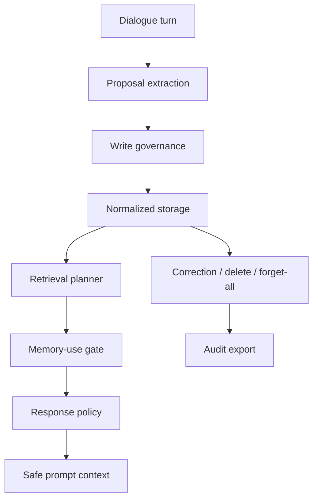

<p align="center">
  <a href="./README.md">English</a>
  ·
  <a href="https://2sao7sao.github.io/EvolveMemory/">产品首页</a>
  ·
  <a href="./examples/adaptive_memory_replay.md">Adaptive Replay</a>
  ·
  <a href="./CONTRIBUTING.md">贡献指南</a>
</p>

<p align="center">
  
  
  
  
</p>

# EvolveMemory

**自适应记忆运行时：决定什么该记、什么能用、什么要隐藏、什么必须忘掉。**

记忆应该让 AI 更自然、更懂用户，而不是让助手在每个回答里生硬地牵扯旧事。

EvolveMemory 把记忆设计成产品控制层：

> 选择性写入，检索候选记忆，门控使用权限，编译安全 prompt context，并支持纠错和遗忘。


## 30 秒产品路径

```text
User turn
  -> memory proposal
  -> write governance
  -> normalized store
  -> retrieval planning
  -> memory-use gate
  -> response policy
  -> safe prompt context
  -> correction / audit
```

| 常见 memory 系统 | EvolveMemory |
| --- | --- |
| 把抽取到的事实都存下来 | 先判断 candidate 是否值得写入 |
| 检索到就注入 prompt | 区分 retrieval 和 permission |
| 过度提及私人细节 | 用 direct、style-only、follow-up、summarize-only、hidden、clarify、suppress 控制使用 |
| 让 prompt 越来越长 | 只编译 prompt-safe context |
| 纠错和遗忘路径弱 | 支持 correction、retirement、forget-all、review queue、audit export |

## 5 分钟 Replay

```bash
git clone https://github.com/2sao7sao/EvolveMemory.git
cd EvolveMemory
python -m pip install -r requirements.txt
python -m memory_system.demo
```

输出形态如下：

```text
# EvolveMemory Adaptive Replay

status: PASS
active_memories_before_correction: 7
accepted_candidates: 4/4
gate_eval: 8/8

## Product metrics
- gate_action_accuracy: 1.00 (8/8)
- explicit_suppression_rate: 1.00 (1/1)
- style_continuity_rate: 1.00 (4/4)
- prompt_safety_rate: 1.00 (1/1)
- correction_retirement_rate: 1.00 (2/2)
```

`python examples/replay_adaptive_memory.py` 会运行同一条产品路径。

## Replay 证明了什么

Replay 会写入两轮对话：

| Turn | 含义 |
| --- | --- |
| `我最近准备面试，有点焦虑。` | 持续事件 + 敏感情绪状态 |
| `回答直接一点，先给结论。` | 稳定沟通偏好 |

然后测试两个不同 query：

| Query | 正确记忆行为 |
| --- | --- |
| `面试怎么准备？` | 面试事件作为 `follow_up`；风格偏好影响回答，但不暴露原始 profile。 |
| `今天只帮我 review Python 代码，不用提面试。` | 面试事件被 suppress；保留风格适配；不注入直接可见记忆。 |

最后模拟用户纠错：用户不想让系统记住焦虑。产品路径会同时退休敏感状态和由它推导出的 profile 信号。

## 指标不是装饰

| 指标 | 衡量什么 | Runtime 来源 |
| --- | --- | --- |
| `gate_action_accuracy` | regression cases 中 memory-use action 是否符合预期 | `evals.runner.run_gate_eval` |
| `explicit_suppression_rate` | 用户明确“不用提 X”时是否抑制匹配事件 | `MemoryUseGate` |
| `style_continuity_rate` | 风格偏好是否能在相关和无关 query 中持续生效 | `SessionMemoryRuntime.query` |
| `prompt_safety_rate` | no-mention query 是否没有注入直接可见记忆 | `PromptContextBuilder` |
| `correction_retirement_rate` | 纠错是否退休敏感状态和派生 profile memory | `SessionMemoryRuntime.retire_memory` |

运行产品 eval：

```bash
python -m evals.runner --suite product_replay_eval
```

只运行 gate regression：

```bash
python -m evals.runner --suite gate_eval
```

## 开发者接口

```bash
# 运行产品 replay
python -m memory_system.demo

# 运行原始抽取 demo
python demo.py

# 启动 API
uvicorn app:app --reload

# 使用 SQLite 持久化
AME_STORAGE_BACKEND=sqlite uvicorn app:app --reload
```

最小 runtime 接入：

```python
from datetime import datetime
from zoneinfo import ZoneInfo

from memory_system import SessionMemoryRuntime

runtime = SessionMemoryRuntime(session_id="user-1")
now = datetime(2026, 5, 1, 9, 0, tzinfo=ZoneInfo("Asia/Shanghai"))

runtime.ingest_turn("回答直接一点，先给结论。", "turn_1", now)
context = runtime.prompt_context("帮我 review 这段代码。", now)
print(context["assembled_prompt"])
```

## API 形态

| Endpoint | 作用 |
| --- | --- |
| `POST /v2/users/{user_id}/turns/ingest` | 摄取用户 turn 到 normalized runtime。 |
| `POST /v2/users/{user_id}/memory/query` | 为当前 query 检索并门控记忆。 |
| `POST /v2/users/{user_id}/prompt-context` | 编译 model-ready memory context。 |
| `GET /v2/users/{user_id}/memory/review-queue` | 查看需要确认的记忆。 |
| `POST /v2/users/{user_id}/memory/{memory_id}/correct` | 纠正并退休冲突 records。 |
| `POST /v2/users/{user_id}/memory/forget-all` | 带 audit trail 清空记忆。 |
| `GET /v2/users/{user_id}/memory/audit/export` | 导出 records、settings、events、audit data。 |

## 架构



## 稳定能力与原型边界

| 层 | 当前状态 |
| --- | --- |
| Rule extraction、write policy、use gate、prompt context | 当前支持的本地产品路径 |
| FastAPI endpoints、in-memory / SQLite persistence | 支持 prototype |
| Review queue、correction、delete、forget-all、audit export | 已实现治理 demo |
| LLM extraction | 有 schema 和 validator；provider-backed extraction 仍是 prototype |
| Benchmarks | regression seeds，不是大规模 personal-memory benchmark |

## 适合 / 不适合

适合：

| 产品 | 原因 |
| --- | --- |
| 个人助手 | 需要稳定风格、事件连续性和纠错路径 |
| AI companion | 需要自然适配，但不能 creepy recall |
| Workflow agent | 需要 memory governance、audit 和 prompt-safe context |
| 长期会话 | 需要 stale-memory suppression 和 forget controls |

不适合：

| 产品 | 更合适 |
| --- | --- |
| Stateless bot | 如果输出不应适配用户，就不要加 memory |
| Transcript search | 用搜索或 RAG |
| 黑盒不可检查 memory | 先使用可治理 store |
| 强监管生产记忆 | 上线前必须补 policy review、privacy review 和 red-team tests |

## 仓库结构

```text
memory_system/   runtime、demo report、extraction、gates、retrieval、context、storage
evals/           gate 和 product replay evaluation runners
tests/           runtime、API、persistence、correction、prompt-safety tests
examples/        可运行 replay 和产品 walkthrough
docs/            GitHub Pages 产品页和设计说明
app.py           FastAPI service
demo.py          本地抽取 demo
```

## Roadmap

| 方向 | 下一步 |
| --- | --- |
| Evaluation | 增加 noisy multi-turn、stale memory、correction、privacy stress suites |
| Extraction | 增加 provider-backed extraction、schema validation 和 disagreement checks |
| Privacy | 增加 sensitive-memory red-team prompts 和 retention policy fixtures |
| Integration | 增加 chatbot、workflow、multi-agent harness examples |

## Security

不要提交真实用户对话、本地 SQLite、session JSON、API key，或包含个人数据的
debug export。见 [SECURITY.md](SECURITY.md)。

## License

MIT. See [LICENSE](LICENSE).
