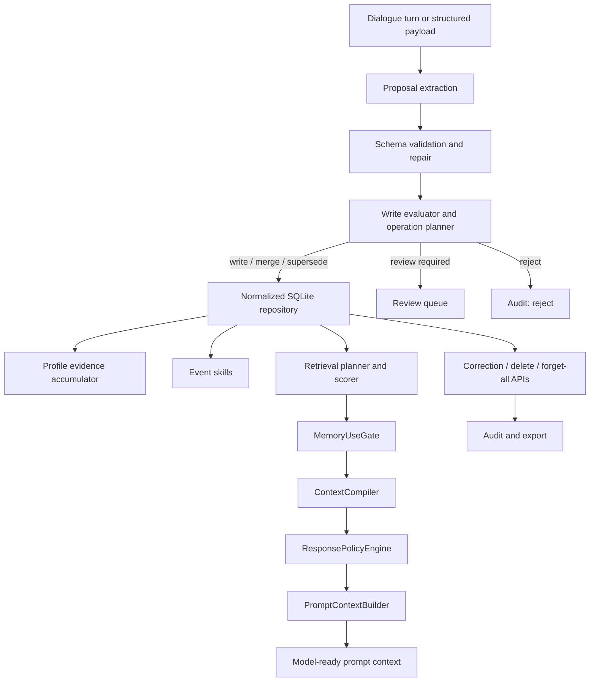

<p align="center">
  <a href="./README.md"></a>
  <a href="./README.zh-CN.md"></a>
  <a href="./CONTRIBUTING.md"></a>
  <a href="./LICENSE"></a>
  
  
</p>

# EvolveMemory

**EvolveMemory 是一个面向对话 AI 与 Agent 的自适应记忆运行时。**

它判断什么应该被记住、什么应该被忽略、哪些记忆和当前任务相关，以及这些
记忆应该如何影响下一次回答。项目面向真实 Agent 产品：记忆必须结构化、
可解释、可纠错、可评审、可审计，并且在不该使用时保持沉默。

```text
User turn -> Proposals -> Write policy -> Store -> Retrieve -> Use gate -> Response policy
```

## 为什么需要 EvolveMemory

很多记忆系统过度关注“存储”：

- 保存太多对话噪声。
- 检索到了事实，却没有判断这个事实是否应该影响回答。
- 把稳定画像、短期状态、偏好和事件混在同一个桶里。
- 缺少明确的纠错、退休、评审和审计路径。
- 让 prompt 变长，但没有让行为更可靠。

EvolveMemory 把记忆视为控制系统。一个记忆只有在正确时刻改变模型行为，并在
无关、敏感、过期或低置信度时保持沉默，才真正有价值。

## 产品原则

目标不是让助手不断强调“我记得你”，而是让记忆自然改善下一次交互，同时避免
刻意、尴尬或无关的提及。

```text
记住重要信息 -> 判断能否使用 -> 调整回答方式 -> 无关时保持沉默
```

## 核心设计

| 层级 | 做什么 | 产品价值 |
| --- | --- | --- |
| Proposal extraction | 将对话或结构化模型输出转成经过校验的 memory proposals。 | 避免原始模型输出直接写入记忆。 |
| Write governance | 对候选记忆评分，检测重复和冲突，并规划 memory operations。 | 降低噪声、冲突和低置信度写入。 |
| Normalized storage | 在 SQLite 中保存 records、evidence、audit events、review queue、settings 和 event states。 | 让记忆可检查、可迁移、可治理。 |
| Retrieval planning | 判断 query intent，并在 gate 前对候选记忆打分。 | 在策略执行前控制上下文范围。 |
| Memory use gate | 将记忆分类为 direct use、style-only、follow-up、summarize-only、clarify、hidden constraint 或 suppress。 | 区分“检索到”和“安全且有用”。 |
| Response policy | 将 gated memory 转成回答风格、结构、详细度、同理心、节奏和决策模式。 | 不把所有记忆塞进 prompt，也能改变模型行为。 |
| Event skills | 跟踪职业、学习、关系变化、搬家和 onboarding 进展。 | 把持续变化的用户事件转成受控 follow-up 行为。 |
| Review and audit | 支持纠错、删除、forget-all、review queue approval 和 export。 | 让记忆可恢复、可治理、可检查。 |

## 架构




## 当前可复现指标

本地最后验证时间：**2026-05-07**。

| 信号 | 当前结果 | 命令 |
| --- | ---: | --- |
| Runtime 与 API 测试 | `52 / 52 passed` | `python -m unittest discover -s tests -p "test_*.py"` |
| Pytest 兼容性 | `52 / 52 passed` | `python -m pytest -q` |
| Gate action eval | `8 / 8 correct` | `python -m evals.runner --suite gate_eval` |
| Gate action accuracy | `1.0000` | `python -m evals.runner --suite gate_eval` |

当前 eval suite 包含三个种子场景：面试准备相关记忆应该触发 follow-up 和
style policy；与代码任务无关的敏感事实应该被 suppress；用户明确说“不用提”
某个事件时，应抑制该事件但保留风格偏好。这是回归种子，不是大规模 benchmark。
它的价值在于验证一个核心产品判断：检索到记忆不等于允许使用记忆。

测试覆盖 legacy runtime 兼容、normalized SQLite storage、write-governance
operations、review queue、sensitivity handling、event skills、profile
evidence accumulation、retrieval planning、memory-use gating、prompt-context
assembly、correction/deletion/forget-all APIs、audit export 和 v2 ingest/query
contracts。

## 快速开始

```bash
git clone https://github.com/2sao7sao/EvolveMemory.git
cd EvolveMemory
python -m pip install -r requirements.txt
```

运行 demo：

```bash
python demo.py
```

运行测试和 eval：

```bash
python -m unittest discover -s tests -p "test_*.py"
python -m evals.runner --suite gate_eval
```

查看自适应记忆 replay：

- [Adaptive memory replay](examples/adaptive_memory_replay.md)

运行 replay：

```bash
python examples/replay_adaptive_memory.py
```

启动 API：

```bash
uvicorn app:app --reload
```

使用 SQLite 持久化：

```bash
AME_STORAGE_BACKEND=sqlite uvicorn app:app --reload
```

## API

| Endpoint | 用途 |
| --- | --- |
| `GET /health` | 检查服务状态和存储后端。 |
| `GET /memory-slots` | 查看声明式 memory slot 规则。 |
| `POST /sessions/{session_id}/ingest` | 通过 legacy-compatible runtime 摄取一个用户 turn。 |
| `POST /sessions/{session_id}/query` | 检索、门控并编译当前 query 的记忆上下文。 |
| `POST /sessions/{session_id}/prompt-context` | 生成 model-ready prompt context。 |
| `POST /sessions/{session_id}/memories/correct` | 纠正记忆，并退休冲突的 active state。 |
| `GET /sessions/{session_id}/audit` | 查看 legacy lifecycle events。 |
| `POST /v2/users/{user_id}/turns/ingest` | 将 turn 摄取到 Phase 2 normalized runtime。 |
| `POST /v2/users/{user_id}/memory/query` | 通过 retrieval planning 和 use gating 查询 normalized records。 |
| `POST /v2/users/{user_id}/prompt-context` | 编译 Phase 2 memory context。 |
| `GET /v2/users/{user_id}/memory/review-queue` | 查看需要用户确认的记忆。 |
| `POST /v2/users/{user_id}/memory/review-queue/{review_id}/resolve` | approve 或 reject review queue items。 |
| `PUT /v2/users/{user_id}/memory/settings` | 更新用户记忆设置。 |
| `POST /v2/users/{user_id}/memory/{memory_id}/correct` | 纠正 normalized memory record。 |
| `POST /v2/users/{user_id}/memory/{memory_id}/delete` | tombstone-delete 单条 normalized memory。 |
| `POST /v2/users/{user_id}/memory/forget-all` | 带审计轨迹地清空用户记忆。 |
| `GET /v2/users/{user_id}/memory/audit/export` | 导出 records、settings、review items、events 和 audit 数据。 |
| `GET /v2/users/{user_id}/memory/profile-evidence` | 查看 inferred profile hypotheses 背后的证据。 |
| `GET /v2/users/{user_id}/memory/events` | 查看 active event-state memories。 |

## 示例

```bash
curl -X POST http://127.0.0.1:8000/v2/users/demo/turns/ingest \
  -H "Content-Type: application/json" \
  -d '{"session_id":"main","text":"我最近准备面试，有点焦虑。回答直接一点，先给结论。"}'

curl -X POST http://127.0.0.1:8000/v2/users/demo/prompt-context \
  -H "Content-Type: application/json" \
  -d '{"session_id":"main","query":"面试怎么准备？","options":{"include_debug":true}}'
```

生成的 context 会区分 direct user facts、style policy、event follow-up cues、
hidden constraints、clarification prompts 和 current user query。这个分层是
核心设计：模型可以使用记忆改变行为，但不会盲目暴露所有存储事实。

## 仓库结构

```text
memory_system/   # extraction、writing、persistence、retrieval、gates、events、profiles、service runtime
evals/           # gate evaluation runner、metrics、JSONL cases
tests/           # runtime、persistence、API、correction、governance、v2 contract tests
app.py           # FastAPI service
demo.py          # 本地命令行 demo
data/            # 本地 JSON 或 SQLite 持久化输出
docs/            # design review、roadmap 和 optimization notes
```

## 适合与不适合

| 适合 | 不适合 |
| --- | --- |
| 需要根据用户偏好调整语气、结构和 follow-up 的个人助手。 | 不希望记忆影响输出的 stateless bot。 |
| 需要明确记忆写入策略和使用策略的 Agent 产品。 | 简单聊天记录搜索。 |
| 查询时必须考虑隐私、相关性和时效性的工作流。 | 总是把所有检索记忆塞进 prompt 的系统。 |
| 需要纠错、评审、删除、forget-all 和审计链路的应用。 | 完全黑盒、无法检查生命周期的记忆存储。 |

## 当前边界

EvolveMemory 目前仍是原型。它还没有证明长周期记忆质量、大规模用户模拟、多模型
抽取质量、对抗 prompt 下的隐私鲁棒性，以及生产负载下的延迟表现。现有测试
验证的是工程链路和核心行为 contract。更完整的 benchmark 应该加入噪声多轮
对话、模糊用户意图、过期记忆、敏感事实、纠错冲突、多语言数据、模型抽取
payload 和 API load measurements。

## 路线图

| 方向 | 下一步 |
| --- | --- |
| Evaluation | 扩展 gate、write-policy、correction、drift 和 long-context memory benchmarks。 |
| Extraction | 增加生产级模型 provider、schema validation 和 disagreement checks。 |
| Privacy | 强化敏感记忆策略、对抗 prompt 测试和用户控制。 |
| Storage | 增加 migration tooling、retention policy 和 multi-user isolation hardening。 |
| Agent integration | 提供 chatbot、workflow 和 multi-agent harness 示例。 |

## License

MIT. See [LICENSE](LICENSE).
