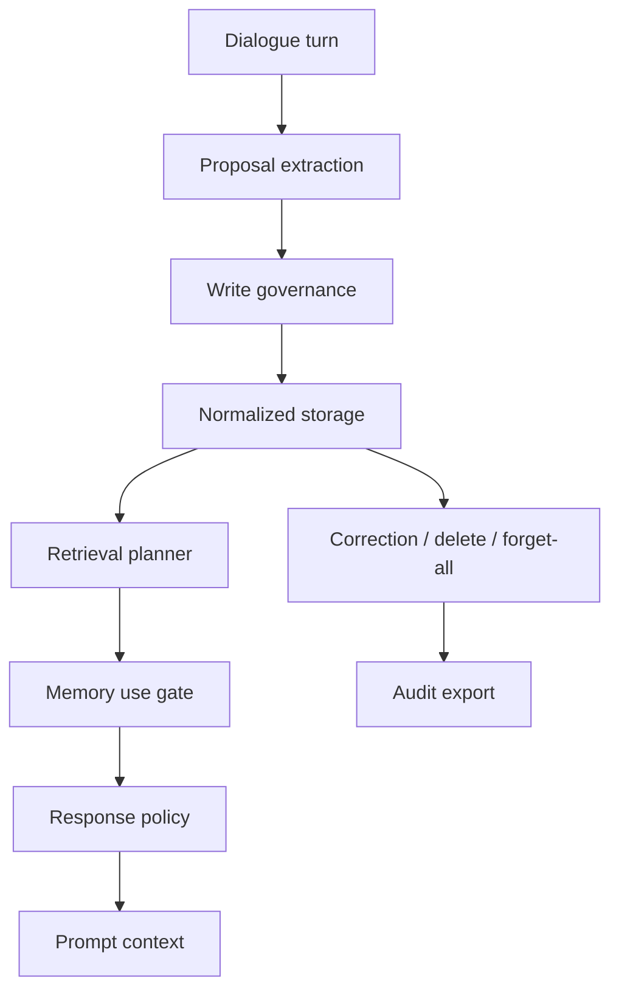

<p align="center">
  <a href="./README.md">English</a>
  ·
  <a href="https://2sao7sao.github.io/EvolveMemory/">产品首页</a>
  ·
  <a href="./examples/adaptive_memory_replay.md">Replay</a>
  ·
  <a href="./CONTRIBUTING.md">贡献指南</a>
</p>

<p align="center">
  
  
  
  
</p>

# 知道什么时候闭嘴的记忆系统

**EvolveMemory 是一个面向对话 AI 和 Agent 的自适应记忆运行时。**

很多 memory 系统只是在“多存一点、多塞一点”。结果是 prompt 变长、用户画像变脏、
隐私风险增加，而且助手会在不合适的时候突然提起旧事，显得刻意又尴尬。

EvolveMemory 把记忆当成控制系统：

> 记住重要信息，检索相关信息，只在合适的时候使用。


## 30 秒理解

```text
User turn -> Memory proposal -> Write policy -> Store -> Retrieve -> Use gate -> Response policy
```

核心区别很简单：

| 普通 memory layer | EvolveMemory |
| --- | --- |
| 保存事实 | 先判断这件事是否值得保存 |
| 检索记忆 | 再判断检索到的记忆能不能用 |
| 把记忆塞进 prompt | 区分 direct、style-only、follow-up、summarize-only、hidden constraint、suppress |
| 让 prompt 更长 | 让行为更自然、更克制、更可控 |
| 纠错路径弱 | 支持 correction、delete、review queue、forget-all、audit export |

## 先跑 Replay

```bash
git clone https://github.com/2sao7sao/EvolveMemory.git
cd EvolveMemory
python -m pip install -r requirements.txt
python examples/replay_adaptive_memory.py
```

Replay 展示核心产品行为：

| Query | 记忆行为 |
| --- | --- |
| “面试怎么准备？” | 面试事件可作为 follow-up；回答风格偏好会影响输出。 |
| “今天只帮我 review Python 代码，不用提面试。” | 面试事件被 suppress；但“先给结论”的风格仍可保留。 |

这才是重点：记忆可以让助手更懂你，但不应该让助手显得冒犯或刻意。

## 为什么需要它

好的 AI 记忆不只是数据库问题，而是产品行为问题。

| 失败模式 | 影响 | EvolveMemory 的处理 |
| --- | --- | --- |
| 保存太多对话残渣 | 记忆变脏、成本变高 | write governance、去重、冲突处理 |
| 提起无关隐私事实 | 用户体验变 creepy | memory use gate、safe-to-mention policy |
| 混淆偏好、事件、画像、状态 | prompt context 混乱 | 分层 memory model |
| 用户纠正后仍沿用旧假设 | 信任崩掉 | correction、delete、forget-all、audit |
| 检索到就注入 prompt | 长 prompt 不等于更聪明 | response policy 只编译真正有用的信息 |

## 你得到什么

| 层 | 作用 |
| --- | --- |
| Proposal extraction | 从对话或结构化模型输出中提取 memory candidates。 |
| Write governance | 接受、拒绝、合并、替换，或送入 review queue。 |
| Normalized storage | 存储 records、evidence、audit events、review queue、settings、event states。 |
| Retrieval planning | 在策略执行前对候选记忆打分。 |
| Memory use gate | 决定 direct use、style-only、follow-up、summarize-only、hidden constraint、clarify、suppress。 |
| Response policy | 把 gated memory 转为语气、结构、详细度、同理心和决策模式。 |
| Review and audit | 支持 correction、deletion、forget-all、review queue、export。 |

## 可信信号

本地最近验证：

| 信号 | 结果 | 命令 |
| --- | ---: | --- |
| Runtime + API tests | `52 / 52 passed` | `python -m pytest -q` |
| Gate eval | `8 / 8 correct` | `python -m evals.runner --suite gate_eval` |
| Replay demo | `PASS` | `python examples/replay_adaptive_memory.py` |

当前 eval 是 regression seed，不是大规模 benchmark。它验证的是产品定义级判断：
检索到记忆，不等于允许使用记忆。

## 常用命令

```bash
# 默认抽取 demo
python demo.py

# 运行 memory gate eval
python -m evals.runner --suite gate_eval

# 启动 API
uvicorn app:app --reload

# 使用 SQLite 持久化
AME_STORAGE_BACKEND=sqlite uvicorn app:app --reload
```

## API 形态

| Endpoint | 作用 |
| --- | --- |
| `POST /v2/users/{user_id}/turns/ingest` | 摄取一个 turn 到 normalized runtime。 |
| `POST /v2/users/{user_id}/memory/query` | 检索并门控当前 query 的记忆。 |
| `POST /v2/users/{user_id}/prompt-context` | 生成 model-ready memory context。 |
| `GET /v2/users/{user_id}/memory/review-queue` | 查看需要确认的记忆。 |
| `POST /v2/users/{user_id}/memory/{memory_id}/correct` | 纠正并退休冲突 records。 |
| `POST /v2/users/{user_id}/memory/forget-all` | 带 audit trail 清空记忆。 |
| `GET /v2/users/{user_id}/memory/audit/export` | 导出 records、settings、events、audit data。 |

## 适合什么

适合：

| 产品 | 原因 |
| --- | --- |
| 个人助手 | 需要语气、结构、事件连续性。 |
| AI companion | 需要自然理解用户，但不能强行提旧事。 |
| Workflow agent | 需要记忆使用策略、review 和 audit。 |
| 长期会话 | 需要纠错、过期抑制和状态演进。 |

不适合：

| 产品 | 更适合 |
| --- | --- |
| Stateless bot | 如果输出不应该适配用户，就不要加 memory。 |
| 简单 transcript search | 用搜索或 RAG。 |
| 完全黑盒 memory store | EvolveMemory 偏向可检查、可治理、可纠错。 |

## 架构



## 仓库结构

```text
memory_system/   # extraction、writing、persistence、retrieval、gates、events、profiles
evals/           # gate eval runner、metrics、JSONL cases
tests/           # runtime、persistence、API、correction、governance tests
examples/        # replay demos
docs/            # 产品首页和设计说明
app.py           # FastAPI service
demo.py          # 本地命令行 demo
```

## Roadmap

| 方向 | 下一步 |
| --- | --- |
| Evaluation | 增加 noisy multi-turn、stale memory、correction、privacy benchmark。 |
| Extraction | 增加 provider-backed extraction、schema validation 和 disagreement checks。 |
| Privacy | 强化 sensitive-memory policy 和 adversarial prompt tests。 |
| Integration | 提供 chatbot、workflow、multi-agent harness 示例。 |

## Security

不要提交真实用户对话、本地 SQLite、session JSON、API key，或包含个人数据的
debug export。见 [SECURITY.md](SECURITY.md)。

## License

MIT. See [LICENSE](LICENSE).
