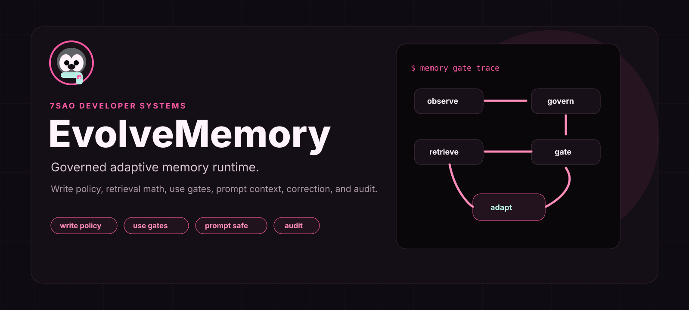
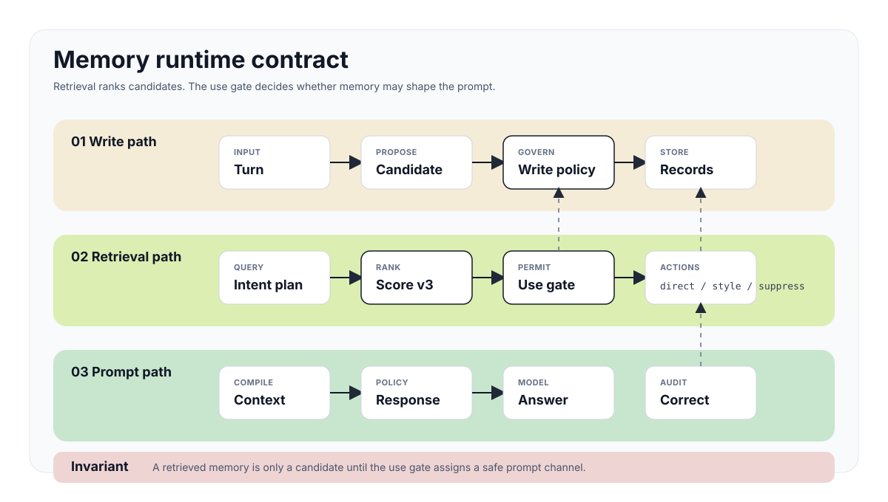
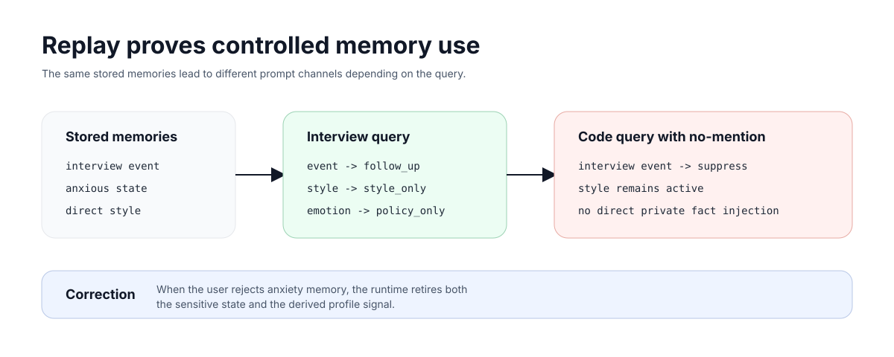
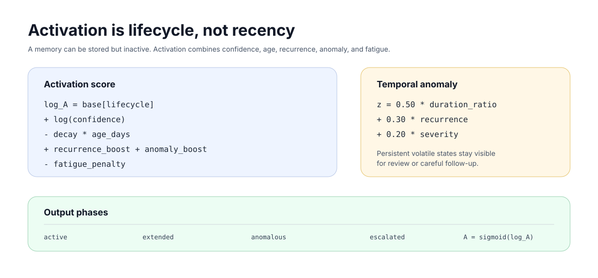
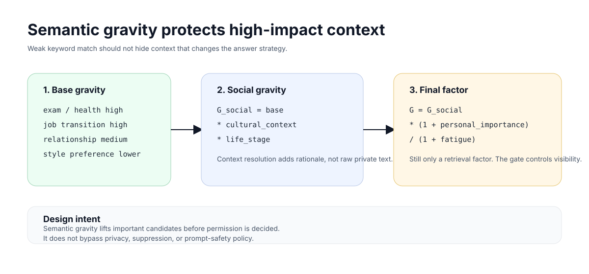
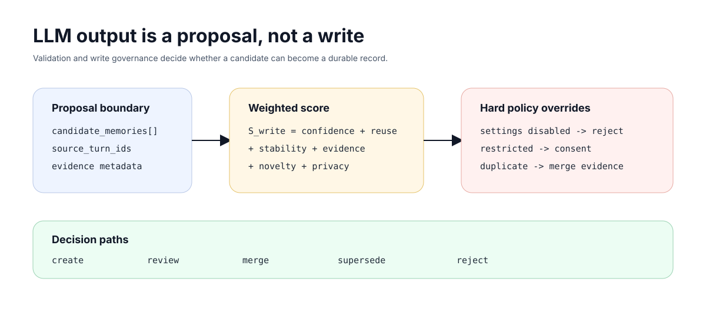

<p align="center">
  <a href="./README.md">English</a>
  ·
  <a href="https://2sao7sao.github.io/EvolveMemory/">产品首页</a>
  ·
  <a href="./examples/adaptive_memory_replay.md">Adaptive Replay</a>
  ·
  <a href="./CONTRIBUTING.md">贡献指南</a>
</p>

<p align="center">
  
  
  
  
</p>

# EvolveMemory

**面向 AI 个性化的可治理自适应记忆运行时。**

EvolveMemory 不是聊天记录仓库，也不是向量数据库封装。它是一套 runtime：
判断什么应该被记住、什么只是候选、什么可以影响回答、什么必须隐藏，以及什么应该被纠正或遗忘。

> Retrieval 不是 permission。被检索出来的 memory 只是 candidate，必须经过
> memory-use gate 决定它能否直接使用、转成风格策略、作为 follow-up cue、作为
> hidden constraint、只做摘要，或者被 suppress。

## Runtime Contract

```text
user turn
  -> proposal extraction
  -> write governance
  -> normalized store
  -> retrieval plan
  -> hybrid math score
  -> memory-use gate
  -> response policy
  -> prompt-safe context
  -> correction / audit / evals
```



| Runtime 边界 | 契约 |
| --- | --- |
| Observe | 从用户 turn 或 provider-free LLM payload 中抽取候选记忆。 |
| Govern | 校验、打分、进入 review、拒绝、合并或 supersede candidate。 |
| Store | 保存 normalized records、evidence、event states、settings 和 audit logs。 |
| Retrieve | 按 intent、relevance、lifecycle、causal impact、semantic gravity 排序候选。 |
| Gate | 决定允许的使用方式：direct、style-only、follow-up、clarify、hidden、summary、suppress。 |
| Compile | 编译 prompt-safe sections，而不是把私人记忆原文塞进 prompt。 |
| Correct | 支持 retire、delete、forget-all 和 audit export。 |

## 这个仓库包含什么

| Surface | 作用 |
| --- | --- |
| Memory runtime | 本地确定性引擎，覆盖 ingest、retrieval、gating、prompt context、correction 和 audit。 |
| FastAPI service | v2 turn ingest、memory query、prompt context、review queue、correction、forget-all、export 接口。 |
| Math model | retrieval、activation、semantic gravity、causal relevance、write decision 的可解释评分对象。 |
| Governance | write policy、sensitivity checks、review paths、correction retirement 和 audit evidence。 |
| Evals | 覆盖 extraction、write decisions、gate actions、privacy、prompt safety 和 replay coherence 的回归套件。 |
| Product docs | GitHub Pages、replay examples、diagrams 和 design review notes。 |

## 5 分钟 Replay

```bash
git clone https://github.com/2sao7sao/EvolveMemory.git
cd EvolveMemory
python -m pip install -r requirements.txt
python -m memory_system.demo
```

输出形态如下：

```text
# EvolveMemory Adaptive Replay

status: PASS
active_memories_before_correction: 7
accepted_candidates: 4/4
gate_eval: 8/8

## Product metrics
- gate_action_accuracy: 1.00 (8/8)
- explicit_suppression_rate: 1.00 (1/1)
- style_continuity_rate: 1.00 (4/4)
- prompt_safety_rate: 1.00 (1/1)
- correction_retirement_rate: 1.00 (2/2)
```

`python examples/replay_adaptive_memory.py` 会运行同一条产品路径。

## Replay 证明了什么

Replay 会写入两轮用户输入：

| Turn | 记忆含义 |
| --- | --- |
| `我最近准备面试，有点焦虑。` | 持续事件 + 敏感情绪状态。 |
| `回答直接一点，先给结论。` | 稳定沟通偏好和结构偏好。 |

然后测试两个 query：

| Query | 正确行为 |
| --- | --- |
| `面试怎么准备？` | 面试事件作为 `follow_up`；风格策略影响回答，但不暴露原始 profile facts。 |
| `今天只帮我 review Python 代码，不用提面试。` | 面试事件被 suppress；保留风格适配；不注入直接可见记忆。 |

最后模拟一次纠错：用户不希望系统记住焦虑。runtime 会同时退休敏感状态和派生 profile 信号。



## Mathematical Runtime

EvolveMemory 把 memory 行为设计成可打分、可解释、可评估的决策链。当前规则是确定性的，
但关键模块都会输出 factors、weights、formula、rationale 和 version，后续可以校准或用反馈数据训练。

`ScoreBreakdown` 是统一解释对象：

| Field | Example value |
| --- | --- |
| `name` | `retrieval` |
| `score` / `probability` | $0.81$ |
| `factors` | $K=0.50,\ A=0.72,\ G=0.88$ |
| `weights` | $w_K=0.22,\ w_A=0.14,\ w_G=0.06$ |
| `formula` | $S_{\mathrm{ret},v3}$ |
| `rationale` | Career query depends on current work or event state. |
| `version` | `retrieval-v3.0` |

这套数学建模按一条流水线阅读：

| 阶段 | 解决的问题 | 产物 |
| --- | --- | --- |
| Retrieval score | 候选记忆先看哪几条。 | 排序后的 candidate list。 |
| Activation | 这条记忆此刻是否仍然活跃。 | lifecycle-aware factor `A`。 |
| Semantic gravity | 词面不强但人类语境重要的记忆是否应被保留。 | impact factor `G`。 |
| Causal relevance | 这条记忆会不会改变安全或有用的回答。 | dependency factor `C`。 |
| Use gate | 排序后的记忆可以如何影响 prompt。 | direct、style、follow-up、hidden、summary、suppress。 |
| Write governance | LLM proposal 能不能成为正式记忆。 | create、review、merge、supersede、reject。 |

### 一、Retrieval Score

Retrieval 只负责候选排序，仍然不等于 permission。

```math
\begin{aligned}
S_{\mathrm{ret},v3}
= \mathrm{clamp}\big(&
0.22K_{\mathrm{keyword}}
+ 0.22E_{\mathrm{embedding}}
+ 0.14F_{\mathrm{freshness}}\\
&+ 0.14L_{\mathrm{layer}}
+ 0.14A_{\mathrm{activation}}
+ 0.08C_{\mathrm{causal}}\\
&+ 0.06G_{\mathrm{gravity}}
\big)
\end{aligned}
```

所有因子都归一到 `0..1`，权重和为 `1.00`。这个分数只回答一个问题：
**哪些候选记忆应该优先被检查？** 记忆能否进入回答、以什么方式进入，仍然由 memory-use gate 决定。

| Symbol | Runtime factor | 含义 |
| --- | --- | --- |
| `K` | `keyword` | 与当前 query 的词面重合。 |
| `E` | `embedding` | 用于本地测试和 demo 的确定性 embedding-like similarity。 |
| `F` | `freshness` | 记忆的新鲜度。 |
| `L` | `layer_prior` | 当前 query intent 是否需要这个 memory layer。 |
| `A` | `activation` | 基于 confidence、age、recurrence、anomaly、fatigue 的 lifecycle activation。 |
| `C` | `causal_relevance` | 这条记忆是否会改变安全或有用的回答。 |
| `G` | `semantic_gravity` | 即使词面不重合，也具有人类语境重要性。 |

Retrieval-v3 故意拆成三层：

| Layer | 设计原因 |
| --- | --- |
| Match | `keyword` 和 `embedding` 保证普通相关性仍然有效。 |
| Lifecycle | `freshness`、`layer_prior`、`activation` 防止过期或错层记忆压过当前任务。 |
| Impact | `causal_relevance` 和 `semantic_gravity` 补回词面弱但会改变回答策略的记忆。 |

### 二、Activation And Temporal Anomaly

Memory 可以被存储，但不一定应该在当前时刻影响行为。Activation 控制生命周期衰减、强化、异常放大和疲劳抑制。

```math
\begin{aligned}
\ell_A
&= b_{\mathrm{lifecycle}}
+ \log(c_{\mathrm{confidence}})
- \lambda_{\mathrm{lifecycle}}a_{\mathrm{days}}\\
&\quad
+ \rho\log(1+r_{\mathrm{count}})
+ \alpha Z_{\mathrm{temporal}}
- \phi f_{\mathrm{fatigue}},\\
A_{\mathrm{activation}}
&= \sigma(\ell_A).
\end{aligned}
```

异常分数先单独计算，再进入 activation：

```math
Z_{\mathrm{temporal}}
= 0.50D_{\mathrm{duration}}
+ 0.30R_{\mathrm{recurrence}}
+ 0.20Q_{\mathrm{severity}}.
```

这样 recency 和状态风险不会混在一起：普通偏好可以长期安静存在，反复出现的流动状态会在必要时保持可见，
用于谨慎 follow-up 或 review。



### 三、Semantic Gravity

Semantic gravity 避免重要生活/安全语境因为词面重合弱而丢失。失业、面试、考试、健康约束、
关系变化、持续情绪状态，通常比普通风格偏好更影响回答策略。

```math
\begin{aligned}
G_{\mathrm{social}}
&= \mathrm{clamp}\!\left(
g_{\mathrm{base}}(k,v)
\cdot w_{\mathrm{culture}}
\cdot m_{\mathrm{life\ stage}}
\right),\\
G_{\mathrm{final}}
&= \mathrm{clamp}\!\left(
\frac{
G_{\mathrm{social}}\left(1+0.35I_{\mathrm{personal}}\right)
}{
1+0.50F_{\mathrm{fatigue}}
}
\right).
\end{aligned}
```

Semantic gravity 也不是 permission。它只保证高影响语境不会在进入 gate 之前丢失；最终是 mention、
hidden、summary 还是 suppress，仍然由 use gate 决定。



### 四、Causal Relevance

Causal retrieval 问的是：这条 memory 会不会改变安全或有用的回答？

```math
C(m,q)=R(m,q)
```

当前实现不是黑盒因果模型，而是可审计的规则依赖：健康/药物约束遇到喝酒问题为 `1.00`，
职业事件遇到求职问题约为 `0.90`，考试、关系、风格类 query 会按各自依赖降级。这样做的目标是先把
“会改变回答安全性或实用性”的记忆抬上来，再交给 gate 控制可见性。

例子：用户问今晚聚会能不能喝酒时，药物或过敏相关 memory 应该被召回，即使它不是最高的关键词匹配。
但召回后仍只是 candidate；memory-use gate 决定它能否、以及如何影响回答。

## Write Governance And Inference Validation

LLM output 永远不是 writer of record。模型可以提出 memory proposal，但 validation 和确定性写入治理
决定每个 candidate 是 create、reject、review、supersede，还是只 merge evidence。



写入治理使用加权分数：

```math
\begin{aligned}
S_{\mathrm{write}}
= \mathrm{clamp}\big(&
0.18C_{\mathrm{confidence}}
+ 0.16R_{\mathrm{reuse}}
+ 0.14P_{\mathrm{personalization}}\\
&+ 0.12T_{\mathrm{stability}}
+ 0.10A_{\mathrm{authority}}
+ 0.10E_{\mathrm{evidence}}\\
&+ 0.08N_{\mathrm{novelty}}
+ 0.07U_{\mathrm{actionability}}
+ 0.05V_{\mathrm{privacy}}
\big)
\end{aligned}
```

`S_write` 只是决策里的加权部分。硬策略仍然优先：settings 禁用会 reject，明确 `do_not_remember`
会 reject，restricted memory 需要 consent，低置信 sensitive memory 需要 review，冲突记录会进入
merge、supersede 或 ask-user-confirmation。

| Symbol | Factor |
| --- | --- |
| `C` | Candidate confidence. |
| `R` | Future reuse value. |
| `P` | Personalization gain. |
| `T` | Temporal stability. |
| `A` | User/source authority. |
| `E` | Evidence quality. |
| `N` | Novelty against existing memory. |
| `U` | Actionability. |
| `V` | Privacy adjustment. |

| Result path | 决策来源 |
| --- | --- |
| `create` | 分数过阈值，且没有 review policy 阻挡。 |
| `review` | sensitivity、restricted consent、低置信度或低 authority 需要用户确认。 |
| `merge` | 重复 memory 只追加 evidence，不创建新 record。 |
| `supersede` | 更高或同等 authority 的 candidate 可以替换 exclusive 冲突值。 |
| `reject` | settings、明确拒绝、硬置信度下限或低加权收益阻止写入。 |

## Memory-Use Gate And Prompt Safety

Gate 会把排序后的候选转换为允许的 action。

```math
\begin{aligned}
S_{\mathrm{gate}}
= \mathrm{clamp}\big(&
0.22Q_{\mathrm{relevance}}
+ 0.14F_{\mathrm{freshness}}
+ 0.14A_{\mathrm{authority}}\\
&+ 0.16U_{\mathrm{utility}}
+ 0.14P_{\mathrm{privacy}}
+ 0.08M_{\mathrm{preference}}\\
&+ 0.06T_{\mathrm{token}}
+ 0.06D_{\mathrm{contradiction}}
\big)
\end{aligned}
```

Gate 的核心不是再排序一次，而是把“可用性”和“可见性”分开：高分记忆也可能因为 privacy、allowed_use、
用户显式 suppression 或 sensitive policy 只能进入 `style_only`、`summarize_only`，甚至 `suppress`。

| Gate action | Prompt channel |
| --- | --- |
| `use_directly` | 只有 safe_to_mention 时才进入 direct user facts。 |
| `style_only` | 转成 style policy，不暴露原始私人证据。 |
| `follow_up` | 最多一个短 progress cue。 |
| `hidden_constraint` | 内部 policy constraint，不对用户可见。 |
| `clarify` | 使用不确定 memory 前先确认当前事实。 |
| `summarize_only` | 只作为聚合上下文，不暴露细节。 |
| `suppress` | 只保留 audit，不进入 prompt。 |

## Developer Surface

```bash
# 运行产品 replay
python -m memory_system.demo

# 运行原始抽取 demo
python demo.py

# 启动 API
uvicorn app:app --reload

# 使用 SQLite 持久化
AME_STORAGE_BACKEND=sqlite uvicorn app:app --reload
```

最小 runtime 接入：

```python
from datetime import datetime
from zoneinfo import ZoneInfo

from memory_system import SessionMemoryRuntime

runtime = SessionMemoryRuntime(session_id="user-1")
now = datetime(2026, 5, 1, 9, 0, tzinfo=ZoneInfo("Asia/Shanghai"))

runtime.ingest_turn("回答直接一点，先给结论。", "turn_1", now)
context = runtime.prompt_context("帮我 review 这段代码。", now)
print(context["assembled_prompt"])
```

## API Surface

| Endpoint | 作用 |
| --- | --- |
| `POST /v2/users/{user_id}/turns/ingest` | 摄取用户 turn 或 provider-free LLM proposal payload。 |
| `POST /v2/users/{user_id}/memory/query` | 为当前 query 检索、打分并 gate memories。 |
| `POST /v2/users/{user_id}/prompt-context` | 编译 model-ready memory context。 |
| `GET /v2/users/{user_id}/memory/review-queue` | 查看需要确认的 memories。 |
| `POST /v2/users/{user_id}/memory/{memory_id}/correct` | 纠正并退休冲突 records。 |
| `POST /v2/users/{user_id}/memory/forget-all` | 带 audit trail 清空 memory。 |
| `GET /v2/users/{user_id}/memory/audit/export` | 导出 records、settings、events 和 audit data。 |

## Evaluation

运行确定性 eval：

```bash
python -m evals.runner --suite retrieval_math_eval
python -m evals.runner --suite gate_eval
python -m evals.runner --suite product_replay_eval
python -m evals.runner --suite profile_evidence_eval
python -m evals.runner --suite response_policy_eval
python -m evals.runner --suite event_skill_eval
python -m evals.runner --suite prompt_context_safety_eval
python -m evals.runner --suite extraction_eval
python -m evals.runner --suite write_decision_eval
python -m evals.runner --suite retrieval_privacy_eval
python -m evals.runner --suite v2_ingest_eval
python -m evals.runner --suite all
```

| Eval | 覆盖契约 |
| --- | --- |
| `retrieval_math_eval` | Activation、causal relevance、semantic gravity 会影响排序。 |
| `gate_eval` | memory-use actions 与 regression cases 预期一致。 |
| `prompt_context_safety_eval` | Profile 和 sensitive memory 不进入 direct prompt facts。 |
| `write_decision_eval` | Governance 正确 create、reject、review、supersede 或 evidence-merge。 |
| `extraction_eval` | Provider-free LLM payload 可以正确 validate、normalize、reject。 |
| `retrieval_privacy_eval` | Sensitive 或 non-promptable memories 在需要时被 suppress。 |
| `product_replay_eval` | End-to-end replay 保持一致。 |

## Stable Boundaries

| Layer | 当前状态 |
| --- | --- |
| Rule extraction、write policy、use gate、prompt context | 支持本地产品路径。 |
| FastAPI endpoints、JSON / SQLite persistence | 支持 prototype。 |
| Review queue、correction、delete、forget-all、audit export | 已实现治理 demo。 |
| LLM proposal ingest | Provider-free payload parsing 已接入 v2 ingest；provider-backed extraction 是后续工作。 |
| Math runtime | Activation、anomaly、causal relevance、semantic gravity、retrieval-v3 scoring 是本地可解释确定性规则。 |
| Benchmarks | 只有 deterministic regression seeds，不宣称大规模 personal-memory benchmark。 |

## Fit / Non-Fit

适合：

| 产品 | 原因 |
| --- | --- |
| 个人助手 | 需要稳定风格、事件连续性和纠错路径。 |
| AI companion | 需要自然适配，但不能生硬召回私人信息。 |
| Workflow agent | 需要 memory governance、audit 和 prompt-safe context。 |
| 长期会话 | 需要 stale-memory suppression 和 forget controls。 |

不适合：

| 产品 | 更合适 |
| --- | --- |
| Stateless bot | 如果输出不应适配用户，就不要加 memory。 |
| Transcript search | 用搜索或 RAG。 |
| 黑盒不可检查 memory | 先使用可治理 store。 |
| 强监管生产记忆 | 上线前补 policy review、privacy review、encryption、migrations 和 red-team tests。 |

## Repository Map

```text
memory_system/   runtime、extraction、gates、retrieval math、context、storage
evals/           extraction、write、retrieval、ingest、gate、replay 的确定性 evals
tests/           runtime、API、persistence、correction、prompt-safety tests
examples/        可运行 replay 和产品 walkthrough
docs/            GitHub Pages 产品页和设计说明
app.py           FastAPI service
demo.py          本地抽取 demo
```

## Roadmap

| 方向 | 下一步 |
| --- | --- |
| Calibration | 增加 Brier score、expected calibration error 和 threshold tuning。 |
| Retrieval | 在现有 scorer contract 后接 production embeddings/vector index。 |
| Extraction | 在已接入的 payload boundary 上增加 provider-backed extraction 和 disagreement checks。 |
| Privacy | 增加 sensitive-memory red-team prompts、encryption、retention policy fixtures 和 migration tests。 |
| Integration | 增加 chatbot、workflow、multi-agent harness examples。 |

## Security

不要提交真实用户对话、本地 SQLite、session JSON、API key，或包含个人数据的
debug export。见 [SECURITY.md](SECURITY.md)。

## License

MIT. See [LICENSE](LICENSE).
