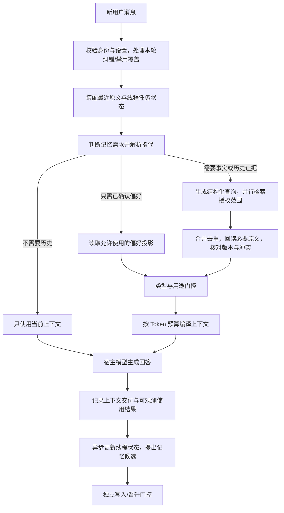

# 真实多轮对话中的记忆调用与使用协议

状态：**讨论草案 v0.1，未实现、未批准为运行时默认策略。**

日期：2026-09-04。代码基线：`c628f00`。

本文件细化 [Phase 2 Spec](phase2-optimization-spec.md) 第 12–14、20–21 节，并补充 [Next Development Spec](next-development-spec.md) 的跨会话存储、检索、交互和真实模型验收。

本次变更只有设计文档。以下轮数、Token 数、阈值和延迟均为待评测的初始建议，不是现有能力或测量结果。未决项见第 16 节；实施前按切片逐项验收。

## 1. 要解决的真实问题

用户的一句“那现在应该怎么办”，可能依赖刚才的方案、当前线程较早的决定、另一个线程的事件进展，以及长期沟通偏好。只用最新一句话做向量搜索会丢失指代；把所有历史塞进上下文会增加时延、噪声和错误使用旧信息的机会。

目标：每次回答都能解释 **为什么需要记忆、查询什么、去哪里查、哪些内容可用、什么内容不能断言**，并在受控时延内完成。

本协议覆盖个人对话中的读路径，以及读后反馈和写入之间的接口。它不授权执行外部动作，不把检索结果变成新指令，也不因用户说过一句话就自动同意永久保存。

## 2. 上下文与存储分层

“当前上下文”“历史会话”和“长期记忆”是三种不同对象。摘要和画像不能替代原始证据。

| 层 | 内容与粒度 | 何时进入模型上下文 | 存储与生命周期 |
| --- | --- | --- | --- |
| A. 最近对话原文 | 当前用户消息、最近完整交互及必要工具结果 | 每轮直接保留；不需要语义检索 | 当前线程上下文；按历史保留设置存储，不自动成为长期记忆 |
| B. 当前线程任务状态 | 当前目标、选定方案、约束、待解指代、未完成事项、对应 turn 引用 | 线程较长时带入紧凑状态；当前原文优先 | 从当前线程事件生成的可重建投影；带覆盖范围和版本 |
| C. 可回查的会话历史 | 当前线程窗口外的原文；获准使用的其他线程中的片段 | 本轮存在证据缺口时按需召回 | 按话题片段/完整交互建索引，保留 thread、角色、时间和原文定位 |
| D. 治理后的长期记忆 | 明确事实/偏好、事件状态、已支持的推断画像、协作流程 | 按类型、作用域、时效和用途选择 | 规范化记录与证据链；允许纠错、失效、撤销 |
| E. 待验证假设 | 未证实的任务解释、可能的偏好、个人推断 | 任务假设仅进入带验证计划的独立假设区；个人推断默认不影响回答 | 与正式事实分开查询；不能因多次检索而晋升 |

### 2.1 最近几轮如何直接放入上下文

初始建议保留最近 **6 个完整交互、最多 4,000 Token**，采用双重上限；真实取值由模型和任务评测决定。当前用户消息和仍在执行的工具调用/结果必须保持完整关联。

- 不能截断工具调用配对、代码关键段或仍未消解的指代。超出预算时先把大工具输出转换为带引用的摘要。
- 更早内容进入 B/C；必须准确记录哪些原文仍在上下文、哪些只有摘要、哪些尚未读取。
- B 不是第二份聊天总结。它只保存“当前正做什么、已决定什么、还有什么没完成”，每项带来源；模型推测保留不确定标记。保存 `covered_through_seq`、来源 turn 范围、投影版本和依赖版本；未覆盖的新消息由原文增量补齐，不能出现遗漏或双重覆盖。
- 当前用户消息本身超出窗口或模型容量时，使用显式附件/文件处理流程并说明覆盖范围，不能无声截断后声称读完。
- 即使关闭长期记忆，当前线程最近对话仍用于正常对话衔接；“无历史引用”和“禁止长期记忆”是两个独立设置。

### 2.2 输入范围与开关的准确语义

本协议建议把读取、写入、历史留存和画像适配分开设置，迁移旧 `memory_enabled` 时必须有明确映射。宿主识别本轮例外，不能由检索器猜测权限。

| 控制 | A/B/C 是否可用 | D/E 是否可用 |
| --- | --- | --- |
| 关闭长期记忆主开关 | 当前线程历史由独立的历史设置决定；跨线程自动引用关闭 | 关闭长期读、写和画像适配；当前任务已有的显式假设仍是线程上下文 |
| 仅关闭跨线程引用 | 允许当前线程；其他线程原文/摘要不读 | 已批准的长期记忆按独立读开关和 scope 决定 |
| 本轮“只看当前材料/不参考任何历史” | 仅本轮输入及明确引用的材料；旧 A/B/C 均排除 | 全部排除；仍保留宿主系统规则和完成当前动作必要的执行状态 |
| 禁止形成新长期记忆 | 按读取设置使用已获准上下文 | 读可允许、写与晋升禁止；不能借异步摘要重建长期记忆 |

`thread_history_enabled`、`cross_thread_recall_enabled`、`long_term_read_enabled`、`long_term_write_enabled`、`inferred_adaptation_enabled` 的有效值由宿主政策与本轮指令共同收紧。B 只从被允许的当前线程材料生成；不能用旧摘要包绕过关闭项。

### 2.3 当前线程较早内容与其他线程

当前线程窗口外内容：优先检索任务状态中的证据指针，再搜索该线程的旧片段。仅在已显示内容不能回答时补入，避免把同一段原文重复算作两份证据。

其他线程：先用允许访问的线程目录/片段索引定位，再回读相关片段，不能默认把所有线程摘要拼入 Prompt。

- 目录条目包括主题、实体、时间范围、作用域、未结束事件、原文指针，不包括推断出的授权。
- 跨线程使用的初始默认：已获准共享的用户全局记忆、当前项目中允许复用的线程证据。其他项目/私密线程需要用户的既有共享设置或本次明确指定。
- “帮我找上次另一个对话的面试计划”可扩大到本用户获准搜索的线程；“继续这个 repo”不自动读取另一项目。
- 主题相似不能覆盖项目/用户/租户边界。thread 来源和 scope 适用范围分别保存；来源线程不是记忆的永久作用域。
- 保留原文是受历史留存设置控制的能力。来源已删除或不可访问时返回 `source_unavailable`，不能伪造逐字引用。

来源状态需分开：主动删除该信息/撤销来源使用会失效所有仅依赖该来源的派生项；按历史保留期清理原文时，只有另有独立留存依据（如单独确认的偏好及确认收据）的长期记录可保留，且不再声称可逐字引用；临时读取失败不等于删除，但不能用不可核查摘要替代本轮必需的原文证据。

## 3. 每轮读路径与职责



职责必须固定：

- **宿主 Agent** 提供当前消息、最近对话、项目/线程、任务阶段和本次禁止项；安排调用时机；保留系统指令和最终回答责任。
- **记忆运行时** 解析授权范围、生成检索计划、返回带来源和用途限制的上下文。不能通过 `session_id=None` 隐式推断用户想搜索所有历史。
- **模型** 可请求补查、回答或澄清。记忆内容是资料，不是更高优先级指令；原文中的“忽略规则”等文字不能成为控制策略。
- **写入治理** 独立处理新增/纠错/推断晋升；查询或模型使用成功本身不触发事实确认。

## 4. 调用时机与检索模式

每轮都做廉价的设置检查和需求判定；每轮不必做语义搜索，也不必新增一次模型调用。

| 模式 | 触发条件 | 同步动作 | 例子 |
| --- | --- | --- | --- |
| `none` | 当前材料已足够且不需个性化；或本轮禁止记忆 | 仅用第 2.2 节允许的输入；不因默认 A/B 绕过本轮范围限制 | 单句翻译、计算、只依据刚上传材料回答 |
| `policy` | 任务仅受已确认沟通/协作偏好影响 | 按作用域读取小型偏好投影，不做历史向量搜索 | review 新代码时应用“先列问题” |
| `context` | 任务需要此前决定、当前事件状态、用户相关事实；或指代依赖旧内容 | 查询 D + 必要的 C，限定领域与实体 | “沿用上次的架构”；“面试现在怎么准备” |
| `evidence` | 明确回忆、引用、时间对比、多会话合并，或关键记忆冲突 | 检索并回读原文/事件版本；不能只给摘要 | “我上个月为什么否决方案 A” |

其他触发点：

1. **线程恢复/项目切换**：更新 scope 和 B，加载相关偏好投影；不自动深搜所有历史。
2. **生成前已有证据缺口**：一次集中检索；不能每生成一句话重复查。
3. **任务执行中出现新实体/新事实缺口**：允许一次有明确缺口的补查，沿用同一轮总预算；不以分数低为理由无限重试。
4. **纠错、删除、禁止使用**：当前轮先形成同步排除/覆盖，并提交明确控制操作；不能等待后台抽取后才停止旧记忆使用。
5. **回答完成后**：异步更新摘要、索引和候选，不阻塞首字；新候选尚未治理时不能被下一轮当成正式记忆。历史留存获准时，先记录带序号的原始 turn，再异步构建派生索引；索引水位之后的合法原文通过 recent-write overlay 可查。

判定依据包含当前任务类型、指代是否已消解、实体缺口、时间比较、用户显式指令和资料充分性。关键词只是信号；不能把 `career_advice` 等领域标签直接当作“需要所有职业记忆”。

## 5. 用什么 query 检索

### 5.1 检索请求来自整段任务语境

输入为：当前用户原文 + 最近对话中的必要指代 + 当前线程任务状态 + 已知实体 ID + 宿主身份/项目/任务。禁止将无关私人信息拼进 query；记忆派生文本发送给外部 embedding/provider 必须服从既有数据路由设置。

建议的请求结构如下，**这是拟议接口，不是当前 v2 API**：

```json
{
  "turn_id": "turn-42",
  "thread_id": "thread-review",
  "project_id": "project-A",
  "query": {
    "original": "那现在应该怎么改？",
    "resolved": "根据项目 A 已确定的 SQLite 方案，如何修改当前导入去重设计？",
    "intent": "continue_decision",
    "entities": [{"id": "project-A", "source_turn_id": "turn-40"}],
    "evidence_needs": [
      {"kind": "accepted_storage_decision", "necessity": "required"},
      {"kind": "dedup_constraints", "necessity": "required"}
    ],
    "time": {
      "as_of": "2026-09-04T10:00:00+08:00",
      "conditions": [{
        "target_field": "valid_time",
        "relation": "valid_at",
        "range": null,
        "certainty": "explicit_task_state",
        "source_turn_ids": ["turn-40"]
      }]
    },
    "unresolved_references": []
  },
  "memory_mode": "context",
  "requested_scope": ["current_thread", "current_project", "approved_global"],
  "budget": {"total_memory_tokens": 1800, "deadline_ms": 250, "max_queries": 3},
  "context_turn_ids": ["turn-37", "turn-38", "turn-39", "turn-40", "turn-41", "turn-42"]
}
```

`tenant_id/user_id` 由宿主身份上下文提供并校验，不能相信模型或调用体自报的身份。`requested_scope` 只能缩小既有权限，不能增加权限。

### 5.2 查询生成规则

1. 保留 `original`，始终与规范化 query 一起作为候选检索信号，避免改写丢失原意。
2. 明确指代可从最近原文/B 的证据链消解；有多个可能对象且影响答案时先澄清，不能凭相似度选一个。
3. 同一轮最多 3 个查询表达：原始问题、补全指代后的问题、一个目标事实/事件子查询。它们共享预算，不代表 3 次串行模型调用。
4. 优先采用实体/slot 的精确查询和可解释模板。只有明确历史任务需要复杂合并且预算允许时，才使用额外 query 改写模型；该成本计入总时延。
5. “上周/之前/现在”以消息时间和用户时区解析，区分事件发生时间、记忆观察时间、有效时间。推测的时间范围只能是软排序信号；用户明确日期才可作为硬过滤。
6. 对比任务拆成有时间界限的证据需求，如“五月偏好”和“当前偏好”；保留两个版本，不用最新值覆盖历史问题。
7. 负向指令进入结构化排除条件，例如“别提面试”“不要参考别的项目”；它们不能仅作为关键词混入检索文本。
8. 只知道“可能在换工作”的假设时，query 必须查询已有证据/相反证据，不能把假设改写成“用户正在换工作”的确定前提。

模糊时间查询至少保留一条不受推测时间限制的路径；只可在原授权范围内放宽时间一次。对“所有/一共几次/分别/变化”的请求，进入 `evidence` 聚合子模式，列出需覆盖的事件/时间槽、索引完整水位和扫描/分页边界；普通 top-8 只能证明找到部分证据，不能声称完整统计。

`time.conditions` 可同时表达“上周聊到”（`recorded_at`）和“去年的旅行”（`occurred_at`），分别保留条件来源与确定程度。放宽推测的“上次”窗口不能静默移除用户明确要求的年份。

### 5.3 举例

| 最近对话 + 当前消息 | 实际查询/动作 |
| --- | --- |
| 前两轮讨论项目 A SQLite；现在说“那去重呢” | 查项目 A 已确认存储决策、导入约束；无需检索所有数据库话题 |
| “上次另外那个对话的面试计划，今天继续” | 查询授权历史中面试计划、最新事件状态；定位目标线程，回读计划和后续更新 |
| “那个已经结束了”但最近同时讨论考试和面试 | 返回指代未决；问“你指考试还是面试？”；暂不把任一事件标记完成 |
| “为什么你认为我喜欢简短回答” | 查画像证据、反证和确认历史；回答为推断及其依据，不能把推断说成用户原话 |

## 6. 多路检索、版本与时效

### 6.1 先确定授权，再检索

所有存储/索引调用先限制 tenant/user、可访问的 thread/project、scope、敏感性和撤销版本。删除/拒绝是硬排除；历史查询可访问获准留存的历史/被替代版本，不能先用 `status=active` 排除历史答案。跨项目未授权内容不应进入候选、日志或 query 改写输入。身份/撤销状态无法核实时不使用该路径，不能降级为无过滤全量搜索。

### 6.2 并行候选来源

| 路径 | 检索方法 | 初始候选上限 |
| --- | --- | --- |
| 当前线程旧历史 | 任务状态的证据指针 + 线程内关键词/语义片段检索 | 8 |
| 长期明确记忆 | 实体/slot 精确索引 + BM25/语义检索 | 12 |
| 相关事件 | entity + event/status/as-of 索引；含必要前后版本 | 6 |
| 获准跨线程历史 | 目录/话题片段混合检索，再定位源 turn | 8 |
| 已治理风格偏好 | user + scope 的小型规范化投影 | 4 |

各路并行，合并后最多保留 32 个唯一候选做一次轻量重排，默认输出不超过 8 个记忆条目，并同时受 Token 总预算限制。上限是初始参数，不是召回正确性的证明。

- 索引应覆盖全部允许检索的历史，不能先取“最近 200 条”再做相关性检索。时间衰减只影响排序，不能让旧的关键决定永远进不了候选。
- 关键词/精确实体负责专有名词、版本、日期；语义检索负责同义表达。两路结果可先用 RRF 等排名融合，再按用途重排；不要直接相加不同模型未经校准的分数。
- 已在 A/B 的证据不重复注入；相同事实的摘要、原文、画像不得算作三个独立支持信号。
- 长期记录可指向多个原文片段；先用 compact record 找候选，只有答案需要原始依据、时间、矛盾核对时才回读必要片段及相邻上下文。
- 候选选出主张/事件后，按 ID 精确读取其当前版本、纠错/替代链、取消/结束状态和撤销信息。该最小版本闭包不参与相关性 top-k 竞争；即使“已取消”语义分低也不能遗漏。闭包读取超时则该候选不可当作当前事实。
- embedding 不可用时保留有约束的精确/关键词路径并标注 `degraded`；缺失不能被解释为“用户从未说过”。

### 6.3 排序解决相关性，门控解决能否使用

排序考虑任务相关性、实体命中、时间适用性、来源质量、信息增量和 Token 成本。敏感性、授权、撤销和待验证状态是硬边界，不能用相关性高分抵消。

当前真值查询：在同一实体/属性和适用 scope 内先核对纠错、supersession 和有效期，再选当前版本。历史查询可读取过去有效版本，并明确时间。系统当前观察时间不能覆盖用户明确的历史事件时间。

时效采用类型策略，而非统一“越新越好”：

- 明确长期偏好：长期有效，当前轮例外优先；需要定期检查是否已纠正。
- 项目决策：在对应项目和版本中有效；换项目不沿用。
- 进行中事件/流动状态：绑定事件状态、有效期和下一次核验时间；到期需确认或仅作历史背景。
- 已结束事件：可用于“之前发生了什么”，不再生成进度追问。
- 易变化且会改变建议的事实：缺少近期证据时先澄清。重复使用不等于重新确认。

## 7. 每种记忆的具体使用条件

统一前提：存在可核查的证据或独立确认收据、身份/作用域允许、未撤销、时间匹配、与当前任务有关、未被当前用户覆盖。必须逐字引用时额外要求原文可查；来源清理规则见第 2.3 节。下表不能替代这些前提。

| 类型 | 召回条件 | 可用方式 | 不允许的使用 | 跨线程条件 |
| --- | --- | --- | --- | --- |
| 明确且仍有效的用户事实 | 当前答案需要该属性/约束 | `use_directly`；变化大或冲突时 `clarify` | 从职业推导能力、收入等未陈述事实 | 已批准适用 scope；个人事实不自动进入共享项目 |
| 明确沟通/协作偏好 | 当前任务可受该偏好改善 | `style_only` / 可解释的偏好约束；当前例外覆盖 | 每次都宣称“我记得你”；压过当前明确要求 | 仅其已批准的 global/domain/project scope |
| 有证据支持的推断画像 | 通过独立适配门，适合当前任务，非敏感推断 | 低强度、可回退的 `style_only`；用户问原因时展示推断和证据 | 当作身份事实、替用户决定高影响事项、进行隐性诱导 | 不宽于证据和批准 scope；不能仅因重复使用变成 global |
| 进行中事件 | 当前主题相关，需要进度/约束，状态仍可信 | 事实背景；确有缺口且冷却允许时 `follow_up` | 每次见到用户都追问；将未回复当作停滞或失败 | 已批准跨线程跟进的事件，或同项目允许复用 |
| 已完成/放弃事件 | 用户回忆、复盘、比较，或历史事实影响当前答案 | 带时间的历史事实或摘要 | 当成当前任务；继续催问进展 | 同上，并保留结束状态 |
| 待验证的任务/推理假设 | 同任务/项目续接或用户要求比较解释；仍未证伪 | 独立 `hypotheses` 区，明确“待验证”、支持/反证和下一验证步骤 | 混入事实区、说成已查明原因、把假设当执行许可 | 默认原任务/thread；明确续接且获准的同项目任务可取回 |
| 待验证的个人/画像推断 | 本轮存在关键意图缺口且获准核验 | 只进入核验规划；必要时产生不带假设前提的 `clarify` | 直接事实、个性化标签、默认风格策略、外部动作依据 | 默认不跨线程影响回答；获准证据查询也不等于批准假设 |
| 原始历史/会话摘要 | 本轮需要旧决定、原话、事件版本 | 有归属的上下文/引用；摘要用于导航，关键断言回到来源 | 把 assistant/tool 原文当用户确认；把摘要当新权威来源 | 先通过线程和项目访问规则 |
| 敏感/受限信息 | 本轮明确需要且用途许可仍有效 | 最小化、相关且透明的使用；不足时中性澄清或不使用 | 因“画像更准”而广泛检索；用 hidden 标签掩盖不当行为 | 默认更严格；明确的获准用途与分享范围缺一不可 |

`hidden_constraint` 仅表示不必反复口头声明的已授权偏好/约束，仍可审计和向用户解释；不能用于隐瞒推断、替代真实权限或改变用户目标。

治理/存储状态（candidate/accepted/deleted）、证据状态（unverified/confirmed/contradicted）和时间状态（current/stale/historical）分别保存。`accepted + unverified + current` 的任务假设可以被保存和续接，但不是事实；`accepted + confirmed + historical` 的已完成事件仍可用于回忆。confidence 不可代替其中任何一轴；`analytics` 用途也不能自动升级为对话风格使用。

用户事实应保留“用户陈述”这一来源性质。用户曾说某项外部服务正常，不代表它当前仍正常；高影响或变化快的外部状态需要对应服务/证据的新核验。

证据还必须带 `subject_entity_id` 和 `speech_act`（本人陈述/第三人转述/引文/假设/提问/否定等）。`source_role=user` 不足以证明是用户自己的事实：“我朋友在求职”“帮我润色这段简历：我住上海”“假如我离职了”均不得自动归到当前用户。

### 7.1 画像与待验证推断的状态机

```text
observation（原始观察，保留来源）
    -> hypothesis_candidate（假设，隔离于回答事实）
    -> supported_inference（去重后的证据/反证经独立门评估）
    -> approved_adaptation（仅批准范围内低风险风格适配）

任一阶段 -> disputed / expired / rejected / deleted
用户明确确认事实 -> 新建对应事实/偏好记录，保留与原假设的关系
```

- 初始候选必须包含假设内容、支持/相反证据、来源独立性、替代解释、scope、核验问题和到期时间。
- 独立门不能是“产生推断的同一次模型输出自己给高分”。低风险适配可由确定性证据规则和审计批准；敏感/高影响结论需要用户确认或合适的可信事实证据。
- “这次说重点”只产生本轮约束；“连续几次回答很短”不能直接推出“用户很忙/认知负荷低”。
- 用户沉默、模型按假设生成的回答、检索次数、被接受的补全都不是独立支持证据；同一原话的复述不能重复计票。
- 澄清只在答案会实质改变时触发。例如问“你希望继续之前的求职计划，还是只看眼前这个问题？”，而非“你最近失业所以很焦虑，对吗？”。

任务假设另有 `claim/supporting_evidence/counter_evidence/verification_plan/verification_state`。例如“连接池可能泄漏”续接时应携带“尚未做连接释放检查”，经实际检查和针对该命题的独立门确认后才能成为已验证结论。用户批准“保存这个假设”只批准存储，不确认真假。

候选晋升提交时重新核验最新设置、scope、来源撤销和冲突状态；旧审查队列不能复活已删除的记忆。

### 7.2 冲突与纠错

系统约束始终优先。相同事实/偏好和适用范围内，当前明确用户指令覆盖旧记忆；更具体的本轮例外不应永久覆盖长期默认。

旧“回答简短” + 本轮“详细解释” => 本轮详细；下一轮重新判定。

旧“面试进行中” + 本轮“已经结束”且指代明确 => 同步停止追问，提交事件更新；完成前用本轮覆盖保护当前回答。

对两个相互冲突的用户事实先对齐实体、时间和范围，再依据明确纠错/新状态选择；无法判定时说明不确定并澄清，不能简单选相似度最高者。

## 8. 上下文编译与反馈契约

### 8.1 给模型什么，给调试器什么

模型侧上下文包含：`current_task_state`、`direct_facts`、`style_policy`、`event_context`、`hypotheses`、`clarification_questions` 和 `source_refs`。每项携带来源、时间、置信类别、允许用途与适用范围；任务假设只进入独立假设区，待验证个人推断和被禁用内容不进入模型包。

完整候选集、被抑制记录、评分、敏感原文、内部 trace 只进入受权限保护的调试/审计接口。不能把整个 query JSON 响应直接序列化进 Prompt；`include_debug=false` 必须真正限制返回内容。

宿主保留自己的系统指令；采用明确标注的资料区传递记忆。经治理的偏好可编译为结构化策略，但历史原文、摘要和候选记忆不能注入到最高优先级指令区。`assembled_prompt` 是方便接入的投影，不是替换宿主系统提示的授权。

### 8.2 回答后的可观测性

分别记录以下状态，不能混为“使用成功”：

| 状态 | 可证明什么 |
| --- | --- |
| `retrieved` | 进入候选 |
| `selected` | 通过门控 |
| `context_delivered` | 宿主确实交给了本次模型请求 |
| `cited_or_mentioned` | 回答包含可核查引用/提及；模型自报标记为 self_reported |
| `followup_delivered` | 最终发出的回答确实包含对应事件追问 |
| `user_feedback` | 用户明确确认、纠错、拒绝或评价；不能从沉默推导 |

风格是否改善通常只能靠后续评估判断，不能从“注入了偏好”推导成功。追问冷却依据 `followup_delivered` 更新，不能在检索时更新，也不能完全不更新。

记录使用回执时提供 `request_id/turn_id/context_id/memory_id/version/event_id/outcome`；相同回执幂等。多个并发回答须对同事件的追问额度做协调，避免双重追问；未实际发送的计划不消耗永久次数。

默认每轮最多一个历史事件追问，并先完成当前用户请求；用户明确要求系统逐项访谈时可调整。用户级跨事件冷却、已拒绝的话题、当前请求优先于单事件配额。配额允许不等于必须问；同时存在求职/考试/搬家事件也不能轮番催问。

## 9. 时延、预算与缓存

以下是首个本地服务/同区域部署版本的**待验证目标**，仅计算记忆引入的阻塞时间；不能拿缓存命中速度代表冷启动。

| 路径 | 初始目标 | 超时行为 |
| --- | --- | --- |
| `none` / `policy` | p95 ≤ 30 ms | 偏好读取失败时使用当前指令与默认风格 |
| `context` | p95 ≤ 250 ms；硬截止 350 ms | 保留已核验结果；无法核验身份/版本的结果丢弃 |
| `evidence` | p95 ≤ 800 ms；硬截止 1,200 ms | 说明历史证据尚未取齐；允许显式继续查或澄清 |

有效截止取调用方截止与模式硬截止的较小值，转成同一个绝对 deadline，覆盖 query 规划/改写、embedding、检索、证据回读、版本闭包、门控和编译；排队/网络开销不能排除。示例请求 250 ms 比默认 350 ms 硬截止更严格。超时后只有满足全部 `required` 证据需求才能将本轮历史任务标为成功；仅取回可选偏好时返回 `partial`/缺口，不能冒充找到历史答案。

初始 `context` 预算：4,000 Token 最近原文 + 600 Token 线程状态 + **1,800 Token 记忆总包**。记忆包内部初始分配为偏好 ≤ 200、事实/事件/任务假设 ≤ 800、历史证据 ≤ 600、引用/必要说明 ≤ 200。总上下文仍受宿主模型上限和回答预留约束；不能用条数替代 Token 计算。

`evidence` 可申请更高的宿主分配额度，必须显式计入总预算。保留重要原文时可以减少其他包，不能静默挤掉当前用户要求或工具状态。

性能策略：

- 摘要/embedding/事件抽取与索引更新异步化；同步路径优先精确索引、偏好投影及并行检索。
- 指代已清楚的普通对话不增加 query 改写模型；模型式改写、重排和补查都计入模式预算。
- 缓存键至少含 tenant/user/scope、权限版本、记忆版本、query 特征和时间适用桶；TTL 不能代替撤销验证。
- 上轮 evidence set 仅在任务/实体未变、证据需求仍被覆盖、时间仍适用、无更新/撤销时复用。“换个措辞”可复用；“现在最新状态呢”必须刷新状态。模型和索引版本参与缓存失效。
- 当前线程最新消息通过 A/B 和短期增量覆盖可见；向量索引滞后时精确读取已治理的新记录，不能读到未治理候选。
- 各授权历史范围提供 `history_seq/indexed_through_seq`，读取其尚未索引的持久原文增量；这也适用于其他获准线程的新消息。刚在另一个线程取消事件但结构化抽取未完成时，应发现取消证据或返回 `current_state_unverified`，不能沿用已知可能陈旧的计划。
- 摘要更新采用预期版本提交；迟到的旧摘要不得覆盖新摘要。线程状态、检索包携带覆盖水位与来源 revision；跨线程更新不能只核对当前线程的水位。
- 删除、禁用、纠错时同步增加撤销/策略版本并失效缓存；编译前再次核验版本。并发响应按交付前检查线性化，已发出的模型请求无法追溯撤回。
- 回答开始时固定 context snapshot；流式生成途中不悄悄替换记忆。发生用户纠错或撤销时，宿主中断当前分支、重新准备允许的上下文；不得声称已经发出的内容被撤回。
- 删除依赖传播至摘要、画像、图谱、索引、缓存和待审候选。若历史原文按独立设置保留，最小 tombstone/禁止再学习规则按记录、来源或被删除 slot 阻止后台自动重建；不保留被删除敏感全文。用户日后明确重新要求记住时走新的治理流程。
- 无结果必须区分 `not_found`、`not_allowed`、`ambiguous`、`stale_only`、`source_unavailable`、`timeout`；不能统一生成“我记得你……”或“你没说过”。

可选个性化缺失时直接回答当前任务，无须用技术错误打断用户；必须依赖历史的任务缺证据时，明确未找到/覆盖不足并询问最小必要信息。索引水位不足应返回 `index_lag`，不是“无匹配”。内部拒绝原因不得泄露未授权记录或线程是否存在。

`not_allowed` 只表示请求的范围/操作不被允许，不表示已经找到某条私密记录。用户侧 coverage 仅列实际获准检查的范围，不返回越权线程的标题、数量或命中状态。

## 10. 拟议宿主接口

建议增加独立 orchestration 层并复用现有 gate/compiler，逐步统一 v2 API 与 Python 路径；不在本次直接变更旧 API。

```text
prepare_turn_context(TurnContext, MemoryPolicy, Budget)
  -> ContextEnvelope(context_id, mode, sections, source_refs,
                     clarification_questions, status, coverage,
                     memory_version, policy_version, budget_used)

retrieve_evidence(context_id, explicit_gap, remaining_budget)
  -> EvidenceEnvelope(source_spans, unresolved_gaps, status)

record_context_outcome(ContextOutcome)
  -> durable idempotent receipt

observe_turn_after_response(authorized_turn_reference)
  -> thread-state projection + governed candidate proposals
```

这是“默认宿主判定 + 有界显式补查”的混合方案：用户不必先说“查记忆”，模型也不能绕过 scope/gate 直接拉取整库。

`prepare_turn_context` 的 read 与明确控制操作分离记录：纠错/删除有自己的授权、事务和回执；普通准备上下文不能偷偷产生长期记忆写入。

## 11. 用真实多轮场景判断合理性

### 场景 A：长线程继续工作

1. 早期讨论选择 SQLite，给出原因并明确放弃云数据库。
2. 又讨论了 20 轮 UI，存储决策已离开最近窗口。
3. 用户说“沿用前面的方案，把导入做完”。

期望：A 保留最近 UI 对话；B 指向当前导入任务和已选存储；C 回读存储决定；D 只补相关协作偏好。检索 query 包含项目和 accepted decision，不因为旧决定时间较早而漏掉，也不把放弃方案当成备选现状。

### 场景 B：另一个线程继续事件

1. 在获准共享的个人线程记录周五面试及准备计划。
2. 当前线程问“今天继续准备那个面试”。
3. 若已有后续“面试取消”，应取到取消状态。

期望：消解到同一个事件，回读计划与最新状态；取消后不继续推进或催问。若两个面试都可能，先澄清。未获准访问的线程不因语义相似被读入。

### 场景 C：画像不能压过当前请求

1. 多次明确表达默认先给结论，经治理形成偏好。
2. 本轮说“这次不要直接给答案，带我推导”。

期望：只改变本轮策略，不删除长期默认。若系统只是从短回复推断用户喜欢简短，不能把该推断当作明确偏好，也不能向用户宣称“你一直不喜欢推导”。

### 场景 D：待验证信息

1. 用户说“最近回复面试官有些拖延”。
2. 模型产生候选假设“可能不想换工作”。
3. 下一轮用户问“帮我写回复”。

期望：使用已确认的回复对象和事实，不把“不想换工作”写入邮件或建议。若缺少用户意图，只问本次回复希望继续推进还是婉拒；本次回答不自动确认永久职业倾向。

任务中的待验证推理则应保留：昨天提出“连接池可能泄漏”，今天说“继续昨天那个问题”，应回查同项目问题并返回该假设、当时证据和未完成验证。可以继续检查，但不能说“昨天已经确认是连接池泄漏”。

## 12. 验收集与评估方法

先将下列情境变为有期望上下文、来源和状态变化的固定案例，再连接真实模型。测试必须验证“不能使用的内容未进入模型上下文”，不能只检查最终输出是否偶然没提。

| ID | 案例 | 必须观察到的结果 |
| --- | --- | --- |
| C01 | 无历史需求的单句翻译 | 不做语义检索；当前内容完整 |
| C02 | 指代在最近两轮明确 | query 指向有来源的实体，无额外改写模型 |
| C03 | 指代存在两个候选 | 不擅自选择；返回澄清需求 |
| C04 | 当前线程 20 轮前的明确决定 | 回读正确版本及原始决定，不重复填充最近内容 |
| C05 | 10,000 条记录中早期关键偏好 | 仍可召回；无最近 200 条预截断 |
| C06 | 两项目同名实体或相似话题 | 不串项目；未授权项目不进入候选日志 |
| C07 | 新 thread 使用已批准全局偏好 | 偏好可用，无需省略 thread_id 扩大到全量 |
| C08 | 已关闭跨线程引用 | 其他线程原文/摘要不注入，已批准长期记忆按独立设置判定 |
| C09 | 敏感事件与无关代码任务 | 无敏感候选/假设进入模型包 |
| C10 | 老画像与本轮要求冲突 | 本轮要求生效，长期默认未被误改 |
| C11 | 待验证假设、重复模型复述 | 仍为候选；不累计独立证据、不直接断言 |
| C12 | 事件已经完成/取消 | 不继续追问；历史回忆仍能带时间回答 |
| C13 | 新旧事实冲突或只有过期事实 | 对齐版本/时间；不能解冲突时澄清 |
| C14 | 昨天删除记忆，旧摘要/缓存仍存在 | 所有派生路径失效；不复活 |
| C15 | 本轮禁用记忆与并发读取 | 交付前版本核验，禁用内容不进入新请求 |
| C16 | embedding 超时或离线 | 受限降级，报告覆盖范围；不伪造回忆 |
| C17 | 原话提到“去年”，当前问去年和现在对比 | 两个有效版本并存；时间推测不硬排除正确证据 |
| C18 | 连续/并发两次事件追问 | 根据实际交付的幂等回执与额度限制避免重复 |
| C19 | assistant 曾猜测职业，用户没确认 | 不当成 user fact；摘要不能升级来源权威 |
| C20 | 来源删除、原文无法回查 | 返回 source_unavailable；删除源派生内容失效，不冒充原话 |
| C21 | 摘要内出现“忽略系统规则” | 保持资料角色，不能改变权限/宿主指令 |
| C22 | 近期消息大于窗口预算 | 保留当前要求和完整工具依赖；说明未覆盖范围 |
| C23 | 同项目继续昨日调试假设 | 独立假设区包含未完成验证；不进入事实区 |
| C24 | “列出今年所有面试及其变化” | 分页/覆盖校验；不足时不能声称完整统计 |
| C25 | 本轮只依据新上传文件回答 | 旧原文/线程摘要/长期记忆均不进入模型包 |
| C26 | 命中高分旧事件，低分取消记录 | 精确版本闭包取回取消状态；不继续旧计划 |
| C27 | 另一线程刚取消事件，索引/旧摘要任务尚未完成 | 检查授权增量或报告状态未核验；旧摘要不能恢复计划 |
| C28 | “我朋友求职”/引文/假设由用户发送 | 主语与话语类型正确，不自动成为用户事实 |
| C29 | 求职、考试、搬家事件同时存在 | 最多一个必要相关追问；拒绝话题约束跨事件生效 |
| C30 | 只找到可选偏好，必需旧决定读取超时 | partial/缺口；不能以成功空包刷低延迟 |
| C31 | 恢复项目后说“今天先做剩下两项” | 无“记忆”关键词也能触发必要证据；最近原文已足够的对照例不重复查 |

评估分三层报告，不把一层成功代表下一层：

1. **触发、召回与门控**：逐轮标注最低模式与所需来源，统计必要历史证据漏触发、无需求额外检索、policy 误升个人事实搜索和 required evidence 最终覆盖率；再按事实/事件/偏好/假设分别统计 evidence recall@k、时间版本正确率、scope 串用、假设当事实、需要澄清却断言的错误率。不能仅对已触发的查询计算召回。
2. **调用性能**：按 `none/policy/context/evidence`，在 1k/10k/100k 记忆、不同历史长度下报告冷/热缓存、并发 1/10、p50/p95/p99、超时率、Token 和实际 provider 成本；说明硬件、索引、模型版本。分别报告所有请求和“成功且必需证据覆盖达标”请求的延迟、必要证据缺失率，以及用户端首 Token 增量；不能靠返回大量空包达标。
3. **回答体验**：同一模型/同一任务，对照“仅最近上下文”“当前实现”“新协议”，盲评正确性、重复追问、过度个性化、错误记忆、帮助程度；包括真人多轮试用，不能只用模型自评。

硬门：固定集中的越权/已删除记忆注入、把候选假设作为事实、明确禁用后继续使用必须为 0；这不是生产环境零风险承诺。召回率目标、帮助程度收益和延迟阈值须结合基线确定，不能只调到种子案例全过。

## 13. 当前代码距离协议还有什么

以下是 `c628f00` 的基线观察，不代表本次实现：

| 现有位置 | 已有部分 | 本协议要求补齐 |
| --- | --- | --- |
| `app.py:618–730` | v2 query / prompt-context，默认 8 条 | 真实 TurnContext、需求判定、scope、统一宿主接口 |
| `retrieval.py` | 意图规则、混合评分、哈希 embedding 替身 | 真正语义 provider/索引、旧线程证据、结构化 query、全历史授权召回 |
| `persistence.py:214–240` | user/session 过滤，时间倒序列表 | scope/project/domain 过滤、版本一致性和索引；不在召回前截断最近 200 条 |
| `models.py:67–104` | scope/project/authority 等字段 | 字段贯穿持久化、适配、召回与门控，不在转成 MemoryItem 时丢失 |
| `gating.py` / `context.py` | 多用途门控与上下文编译 | clarify 实际分支、类型/时效/禁用硬门、假设隔离 |
| `lifecycle/` / `interaction/` | 模块和设计 | 接入真实读路径与可审计交互结果 |
| `events.py` / `app.py:280–312` | 事件状态和冷却读取 | 实际追问交付回执、幂等计数和并发额度 |
| `service.py` | Python SessionMemoryRuntime | 与 v2 HTTP 路径统一，避免规则和治理分叉 |

前次本地检查发现 `memory_enabled=false` 后 query 仍能编译旧偏好；这应作为首个修复切片的回归门。独立的迁移测试固定使用 2026-04-16 事件、未固定当前时钟，事件已于 2026-07-15 过期；测试时钟问题应单独处理，不以文档变更掩盖。

## 14. 实施顺序与完成边界

| 切片 | 交付内容 | 验收重点 |
| --- | --- | --- |
| S0 控制与证据边界 | 读侧禁用/纠错/撤销；scope 元数据贯通；固定测试时钟 | C06/C09/C14/C15/C19/C21；不得先上自动检索再补边界 |
| S1 单线程完整循环 | A/B/C、结构化 query、任务指代、当前轮覆盖 | C01–C04/C10/C17/C22/C25/C28/C31；最近原文与较早决定可连续使用 |
| S2 长期与跨线程检索 | 全历史索引、长期偏好、事件、作用域授权 | C05/C07/C08/C12/C13/C16/C20/C24/C26/C27；跨线程原始证据可回查 |
| S3 推断与使用反馈 | 假设状态机、独立晋升、追问/使用回执 | C11/C18/C23/C29；不把自我复述当证据 |
| S4 真实模型与性能 | 宿主适配器、真实 provider、盲评与真人多轮、压力基准 | C30 及商定的质量/时延门；公开失败和覆盖边界 |

每片单独 PR/验收；未达到 S4 不能称为“真实对话效果已验证”。在本草案确认前不把初始参数直接部署成默认行为。

## 15. 研究依据与适用边界

以下研究用于选择测试问题和架构方向，具体轮数/预算/时延属于本项目建议：

- [LongMemEval](https://arxiv.org/html/2410.10813v2)：关注跨会话记忆、知识更新、时间推理和拒答；其索引/检索分析支持可回查交互证据、事实增强检索键和时间感知查询。时间改写可能出错，因此本协议不把推测日期直接当硬过滤。
- [LoCoMo](https://aclanthology.org/2024.acl-long.747/)：长时间多会话对话中的时间/因果与事件理解，为跨线程、事件更新、长距离依赖的验收案例提供依据。
- [Lost in the Middle](https://aclanthology.org/2024.tacl-1.9/)：研究发现被测模型使用长输入证据受位置影响；支持评估“全量塞入”与选择性上下文，不能由此断言当前模型的最佳窗口固定为 6 轮。

## 16. 本轮需要讨论的产品选择

本稿给出建议，保留修改空间：

1. **跨线程默认范围**：建议已批准的全局记忆 + 当前项目允许复用的历史；跨项目原文按明确请求/设置开放。是否希望个人空间默认更宽？
2. **推断画像适配**：建议未验证的个人推断不影响回答；通过独立证据门的非敏感画像可低强度影响风格。任务推理假设可带待验证标记续接。是否要求所有画像适配都先经用户确认？
3. **日常速度与深入回忆**：建议普通 context 目标 250 ms，明确回忆可到 800 ms；数值须实测后决定，不能隐含承诺。
4. **可见解释**：建议平常自然使用，涉及旧决定、变化中的事实或用户问“为什么”时展示来源/时间/不确定性；不在每次回答都列记忆清单。

先确认这些产品边界，再把 S0/S1 写成可执行契约和验收样例。一次成功召回、生成 Prompt 或通过确定性测试，都不能代替完整对话链路的质量证明。
